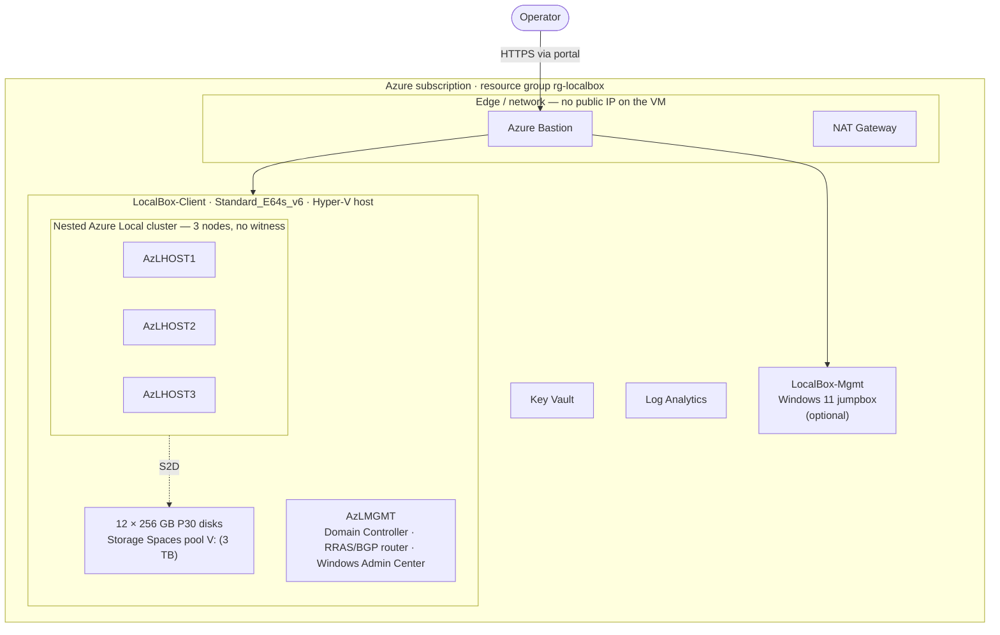

# apex-localops

**Evaluate Azure Local — full cluster or Small Form Factor — inside a single Azure VM. No physical hardware.**

A self-contained, deploy-ready packaging of the Arc Jumpstart **LocalBox** sandbox.

[**Azure Local deploy guide**](docs/deployment-quickstart.md) &nbsp;·&nbsp; [**SFF deploy guide**](docs/sff-quickstart.md) &nbsp;·&nbsp; [**Architecture**](#architecture) &nbsp;·&nbsp; [**Cost**](#cost) &nbsp;·&nbsp; [**Docs**](#documentation)

## Overview

apex-localops stands up complete, nested **Azure Local** (formerly Azure Stack HCI)
evaluation environments inside a **single Azure VM** — no physical hardware. The Bicep
templates and the in-VM build automation are **vendored in this repo**, so a deploy does not
depend on any third-party repository.

Two evaluation profiles are included — pick the one you need and follow its deployment guide:

| Profile | What it builds | Est. cost (24×7) | Deployment guide |
| --- | --- | --- | --- |
| **Azure Local (LocalBox)** | A nested 2- or 3-node Azure Local cluster + management host (Domain Controller, router, Windows Admin Center) in one Hyper-V VM | ~$7,850/mo | **[Azure Local deployment guide →](docs/deployment-quickstart.md)** |
| **Small Form Factor (SFF)** | A lighter single nested-virtualization host that builds the SFF **Maintenance OS (ROE)** test VM (Gen2, TPM on, Secure Boot off, ≥4 vCPU) — the edge/SFF analogue at ~1/10th the cost | ~$700–900/mo | **[SFF deployment guide →](docs/sff-quickstart.md)** |

> [!NOTE]
> Both profiles deploy into a **Bastion-only** resource group (no public IP on the VMs) and
> register the required resource providers via a bundled `check-providers` script. SFF is in
> **PREVIEW** and is for testing/evaluation only — production SFF must run on validated
> hardware.

## Architecture

<b>Azure Local (LocalBox) — nested cluster topology</b>

The SFF profile uses a lighter single-host topology — see its
[deployment guide](docs/sff-quickstart.md#architecture).

## What it deploys

**Azure Local (LocalBox)** — default 3-node profile:

- `LocalBox-Client` Hyper-V host VM (`Standard_E64s_v6`, 64 vCPU / 512 GB) + 12 × 256 GB P30 disks (3 TB pool)
- Nested `AzLHOST1/2/3` cluster nodes (no witness) and `AzLMGMT` (Domain Controller, RRAS/BGP router, Windows Admin Center)
- VNet, NSG, Bastion, NAT Gateway, Key Vault, Log Analytics, and an optional Windows 11 jumpbox

**Small Form Factor (SFF)**:

- `LocalSFF-Host` nested-virtualization VM (`Standard_D8s_v5`) that builds one Gen2 ROE test VM (TPM on, Secure Boot off, ≥4 vCPU)
- Bastion, NAT Gateway, Key Vault (ownership voucher), staging storage, and an optional Windows 11 jumpbox

Topology profiles, host SKUs, and the full cost breakdown live in the sizing docs:
[sizing-guidance.md](docs/sizing-guidance.md) (Azure Local) and
[sff-sizing.md](docs/sff-sizing.md) (SFF).

## Cost

Both profiles bill for **disks, Bastion, and NAT Gateway even when the VMs are stopped** —
delete the resource group to stop all charges.

- **Azure Local:** ~$7,850/month at 24×7 (Sweden Central, retail pay-as-you-go) — the
  `Standard_E64s_v6` host plus 12 × P30 data disks dominate the bill. Breakdown:
  [sizing-guidance.md](docs/sizing-guidance.md).
- **SFF:** ~$700–900/month at 24×7 — roughly 1/10th the cost. Breakdown:
  [sff-sizing.md](docs/sff-sizing.md).

## Documentation

**Deployment guides — start here (one per product):**

| Product | Guide | What's inside |
| --- | --- | --- |
| **Azure Local** | [Azure Local deployment guide](docs/deployment-quickstart.md) | Prerequisites, register providers, deploy (incl. 2-node + pin-a-release), the in-VM build, monitoring, customization, and clean up. |
| **Small Form Factor** | [SFF deployment guide](docs/sff-quickstart.md) | Prerequisites, register providers + ZTP, deploy, stage the ROE ISO + Configurator App, monitor, ownership voucher, and clean up. |

**Reference:**

| Guide | What's inside |
| --- | --- |
| [Sizing guidance](docs/sizing-guidance.md) | Azure Local VM/disk sizing, the full cost breakdown, and the 2- vs 3-node topology rationale. |
| [Troubleshooting](docs/troubleshooting.md) | Azure Local failures and recovery — witness-location mismatch, preflight blocks, and more. |
| [SFF sizing](docs/sff-sizing.md) | SFF host SKU options, cost, and the LocalBox-vs-SFF comparison. |
| [SFF runbook](docs/sff-runbook.md) | Ownership voucher download and Azure-portal machine provisioning. |
| [SFF plan](docs/sff-support-plan.md) | Full SFF engineering plan and milestone breakdown. |
| [AKS on bare metal quickstart](docs/aks-baremetal-quickstart.md) | Optional SFF follow-on — deploy a managed, Arc-connected single-node AKS cluster on the provisioned machine (preview, East US, zero-rated). |

## Provenance & license

This project packages and customizes the **Arc Jumpstart LocalBox** sandbox from
[`microsoft/azure_arc`](https://github.com/microsoft/azure_arc) (`azure_jumpstart_localbox`),
vendored from commit `027b9554b2534af190271bd7443d8556da745d3e`. As a derivative work it is
distributed under the **same license as upstream — Creative Commons Attribution 4.0
International (CC BY 4.0)**; see [LICENSE](LICENSE) and the credit + list of changes in
[ATTRIBUTION.md](ATTRIBUTION.md). Azure Local OS images, PowerShell, and Windows Admin
Center are downloaded from Microsoft at build time and remain subject to their own license
terms.
