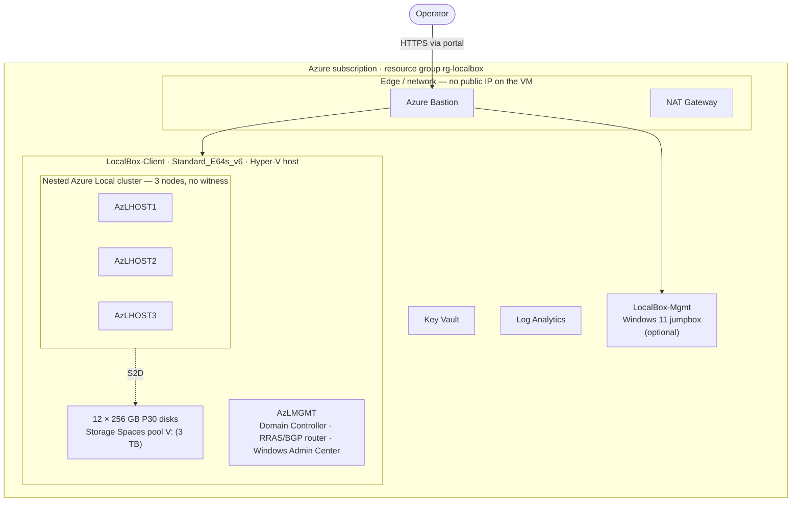

# apex-localops documentation

Evaluate Azure Local — a full cluster or a Small Form Factor edge device — inside a single
Azure VM, with no physical hardware. This is the documentation hub: start here, pick a
profile, and follow its guide.

> [!NOTE]
> **Draft release — work in progress.** This project is still being built and validated.
> Templates, scripts, and docs may change, and not every profile has been validated end to end.
> See [Project status](../README.md#project-status) for the per-profile maturity.

- New to the project? Read [Choose a profile](choose-a-profile.md) to pick the right path.
- Unfamiliar with a term? See the [Glossary](glossary.md).
- Looking for the code and badges? See the [project README](../README.md).

## Choose a profile

apex-localops ships three evaluation profiles. Each one builds a nested Azure Local
environment inside one Azure VM and deploys into a Bastion-only resource group with no public
IP on the VMs.

| Profile | What it builds | Est. cost (24×7) | Start here |
| --- | --- | --- | --- |
| **LocalBox** | A nested 2- or 3-node Azure Local cluster plus a management host, from Arc Jumpstart artifacts | ~$7,850/mo | [LocalBox quickstart](localbox/quickstart.md) |
| **Self-hosted** | The same nested cluster, built clean-room from operator-staged ISOs (no Jumpstart dependency) | ~$7,850/mo | [Self-hosted quickstart](selfhosted/quickstart.md) |
| **Small Form Factor (SFF)** | A single nested edge test VM (Maintenance OS / ROE) at roughly one-tenth the cost | ~$700–900/mo | [SFF quickstart](sff/quickstart.md) |

For a feature-by-feature comparison and a decision guide, see [Choose a profile](choose-a-profile.md).

> [!NOTE]
> SFF on a VM is a **preview** evaluation path and is for testing only. Production SFF must
> run on [validated hardware](https://learn.microsoft.com/azure/azure-local/small-form-factor/small-form-factor-overview#supported-devices).

## Architecture at a glance

The LocalBox profile builds a nested 3-node cluster and a management host inside one Hyper-V
host VM. The self-hosted profile uses the same topology, built from ISOs across two VMs; SFF
uses a lighter single-host topology.

**Diagram key:** solid arrows are network paths; the dotted arrow is the Storage Spaces Direct
(S2D) data path that pools the host disks. The operator reaches the host only through Azure
Bastion. Per-profile diagrams live in each profile's overview:
[LocalBox](localbox/overview.md) · [Self-hosted](selfhosted/overview.md) · [SFF](sff/overview.md).

## Cost at a glance

Every profile bills for **disks, Bastion, and NAT Gateway even when the VMs are stopped**.
Delete the resource group to stop all charges. Figures are retail pay-as-you-go in Sweden
Central (LocalBox, self-hosted, and the SFF host), with Azure Hybrid Benefit on.

| Profile | Always-on (24×7) | Deallocated floor | Full breakdown |
| --- | --- | --- | --- |
| LocalBox | ~$7,850/mo | ~$1,933/mo | [LocalBox sizing](localbox/sizing.md) |
| Self-hosted | ~$7,850/mo | meaningful floor | [Self-hosted sizing](selfhosted/sizing.md) |
| SFF | ~$700–900/mo | ~$250/mo | [SFF sizing](sff/sizing.md) |

## Documentation index

### LocalBox profile

| Guide | What's inside |
| --- | --- |
| [Overview](localbox/overview.md) | Topology, what gets deployed, and when to use this profile. |
| [Quickstart](localbox/quickstart.md) | Prerequisites, register providers, deploy, monitor the in-VM build, connect, and clean up. |
| [Sizing and cost](localbox/sizing.md) | VM and disk sizing, the full cost breakdown, and the 2- vs 3-node topology rationale. |
| [Troubleshooting](localbox/troubleshooting.md) | Deployment and build failures, witness and policy issues, and recovery steps. |

### Self-hosted profile

| Guide | What's inside |
| --- | --- |
| [Overview](selfhosted/overview.md) | The clean-room topology, the RBAC model, and the end-to-end build flow. |
| [Quickstart](selfhosted/quickstart.md) | Register providers, deploy, stage the two ISOs from the jumpbox, monitor the build, and confirm success. |
| [Sizing and cost](selfhosted/sizing.md) | Host SKU allow-list, the 2-node alternative, cost control, and the build time budget. |

### Small Form Factor profile

| Guide | What's inside |
| --- | --- |
| [Overview](sff/overview.md) | The SFF topology, what gets deployed, and how the pieces fit together. |
| [Quickstart](sff/quickstart.md) | Register providers, deploy, stage the ROE ISO and Configurator App, and monitor the build. |
| [Runbook](sff/runbook.md) | Download the ownership voucher and provision the machine from the Azure portal. |
| [Zero-touch deployment](sff/zero-touch.md) | Chain every stage — providers through AKS — with one orchestrator. |
| [AKS on bare metal](sff/aks-baremetal.md) | Deploy a single-node, Arc-connected Kubernetes cluster onto the provisioned machine. |
| [Sizing and cost](sff/sizing.md) | Host SKU options, nested VM count, cost, and the LocalBox-vs-SFF comparison. |

### Reference

| Guide | What's inside |
| --- | --- |
| [Choose a profile](choose-a-profile.md) | Side-by-side comparison and a decision guide. |
| [Roadmap and known limitations](roadmap.md) | Per-profile maturity, what is being validated, and known limitations. |
| [Glossary](glossary.md) | Acronyms and terms used throughout the docs. |
| [Vendored SFF docs](azure-local-sff/README.md) | How the upstream Microsoft SFF documentation mirror is used. |

## Recommended journeys

Each journey starts at a quickstart and ends with a running environment.

- **Evaluate the full cluster (fastest):** [Choose a profile](choose-a-profile.md) →
  [LocalBox overview](localbox/overview.md) → [LocalBox quickstart](localbox/quickstart.md) →
  [Troubleshooting](localbox/troubleshooting.md) if needed.
- **Build the cluster clean-room (no Jumpstart):** [Self-hosted overview](selfhosted/overview.md) →
  [Self-hosted sizing](selfhosted/sizing.md) → [Self-hosted quickstart](selfhosted/quickstart.md).
- **Evaluate an edge device:** [SFF overview](sff/overview.md) →
  [SFF quickstart](sff/quickstart.md) → [SFF runbook](sff/runbook.md) →
  [AKS on bare metal](sff/aks-baremetal.md). For the hands-off path, use
  [Zero-touch deployment](sff/zero-touch.md).

---

[Project README](../README.md) · [Choose a profile](choose-a-profile.md) · [Glossary](glossary.md)
