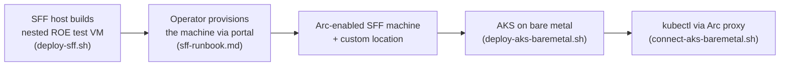

# AKS on bare metal (preview) — Quickstart

Deploy a single-node **Azure Kubernetes Service (AKS) on bare metal** cluster onto the
Arc-enabled **Small Form Factor (SFF)** machine produced by the [SFF profile](sff-quickstart.md).
AKS on bare metal runs Kubernetes **directly on the device — no hypervisor** — and is managed
through the same Azure plane (ARM/Bicep/portal) as AKS everywhere else.

> [!IMPORTANT]
> AKS on bare metal is in **PREVIEW**: **East US only**, Kubernetes **1.34.2/1.34.3**,
> **single-node**, **Cilium** CNI. Cluster resources are **zero-rated** during preview (the
> underlying Arc machine and any Azure services still bill). Not for production.

## Where this fits



The cluster is a **separate, post-provisioning deployment** because it needs the **custom
location** and **control-plane IP** that only exist once the SFF edge machine is
**Provisioned**.

## Prerequisites

1. A **Provisioned** SFF edge machine (complete [sff-runbook.md](sff-runbook.md) §1–4).
2. **Owner**, or **Contributor + User Access Administrator**, on the resource group
   (Active + Permanent).
3. Providers registered — already handled by
   [check-providers-sff.sh](../scripts/check-providers-sff.sh) (`Microsoft.HybridContainerService`,
   `Microsoft.Kubernetes`, `Microsoft.ExtendedLocation`, `Microsoft.HybridCompute`).
4. The `connectedk8s` CLI extension (the deploy script installs it if missing).
5. A Microsoft **Entra security group** for cluster admins — note its **object ID**.
6. An **SSH public key** (e.g. `~/.ssh/id_rsa.pub`).

## Gather the four inputs

| Input | How to get it |
| --- | --- |
| **Custom location ID** | `az customlocation list -o table` (or the edge machine resource). It's the `Microsoft.ExtendedLocation/customLocations` ARM ID for your site/machine. |
| **Control plane IP** | A free IP in the **same subnet** as the edge machine, **not** the machine's own IP. If the machine uses DHCP, **reserve** it so it never changes. |
| **Admin group object ID** | Azure portal → Entra ID → Groups → your group → **Object ID**. |
| **SSH public key** | `cat ~/.ssh/id_rsa.pub` (the deploy script reads this by default). |

Export them (kept out of the committed params; resolved at deploy time):

```bash
export AKSBM_CUSTOM_LOCATION_ID="/subscriptions/<sub>/resourceGroups/<rg>/providers/Microsoft.ExtendedLocation/customLocations/<cl>"
export AKSBM_CONTROL_PLANE_IP="192.168.200.50"
export AKSBM_ADMIN_GROUP_ID="<entra-group-object-id>"
# SSH key is read from ~/.ssh/id_rsa.pub automatically, or:
export AKSBM_SSH_PUBLIC_KEY="$(cat ~/.ssh/id_rsa.pub)"
```

## Deploy

```bash
./scripts/deploy-aks-baremetal.sh
```

The script installs `connectedk8s` if needed, runs preflight (region, input shape, providers,
custom-location resolution), previews with `what-if`, deploys, and prints the connect command.
Deployment takes **~20 minutes**.

Useful flags:

```bash
./scripts/deploy-aks-baremetal.sh --what-if-only          # preview only
./scripts/deploy-aks-baremetal.sh --ssh-key-file ~/.ssh/id_ed25519.pub
./scripts/deploy-aks-baremetal.sh -g rg-localsff-aks -l eastus
```

## Connect

Run from your **local machine / devcontainer** (not Cloud Shell — the proxy needs a local
token audience):

```bash
./scripts/connect-aks-baremetal.sh --name localsff-aks --resource-group rg-localsff-aks --get-nodes
```

That starts the Arc proxy, runs `kubectl get nodes`, and stops the proxy. Expected:

```
NAME            STATUS   ROLES           AGE   VERSION
localsff-aks    Ready    control-plane   1d    v1.34.3
```

For an interactive session, omit `--get-nodes` — it starts the proxy in the foreground; run
`kubectl` from a second terminal.

## What gets deployed

| Resource | Role |
| --- | --- |
| `Microsoft.Kubernetes/connectedClusters` (kind `ProvisionedCluster`) | Arc projection; carries identity + the Entra admin group (Azure RBAC for Kubernetes) |
| `Microsoft.HybridContainerService/provisionedClusterInstances` (`default`) | The actual single-node cluster, pinned to the SFF machine via `extendedLocation` (custom location) |

Template: [infra/bicep/aks-baremetal/main.bicep](../infra/bicep/aks-baremetal/main.bicep).
Defaults (overridable in [main.bicepparam](../infra/bicep/aks-baremetal/main.bicepparam)):
single control-plane node, one Linux (CBLMariner) agent, Cilium, pod CIDR `10.244.0.0/16`.

## Clean up

```bash
az group delete --name rg-localsff-aks --yes
```

Cluster resources are zero-rated in preview, but deleting the group removes the Arc
projections cleanly. The SFF resource group (`rg-localsff`) is separate.

## Preview-volatility note

The preview API versions are centralized at the top of
[main.bicep](../infra/bicep/aks-baremetal/main.bicep)
(`connectedClusters` `2024-07-15-preview`, `provisionedClusterInstances` `2026-04-01-preview`).
If a preview revision changes the contract, bump them there. Canonical docs are on
[Microsoft Learn](https://learn.microsoft.com/azure/aks/aksarc/aks-bare-metal-overview)
(the AKS bare metal preview docs are not yet mirrored to a public GitHub repo, so unlike the
SFF docs they are not vendored here — refer to Learn directly).
