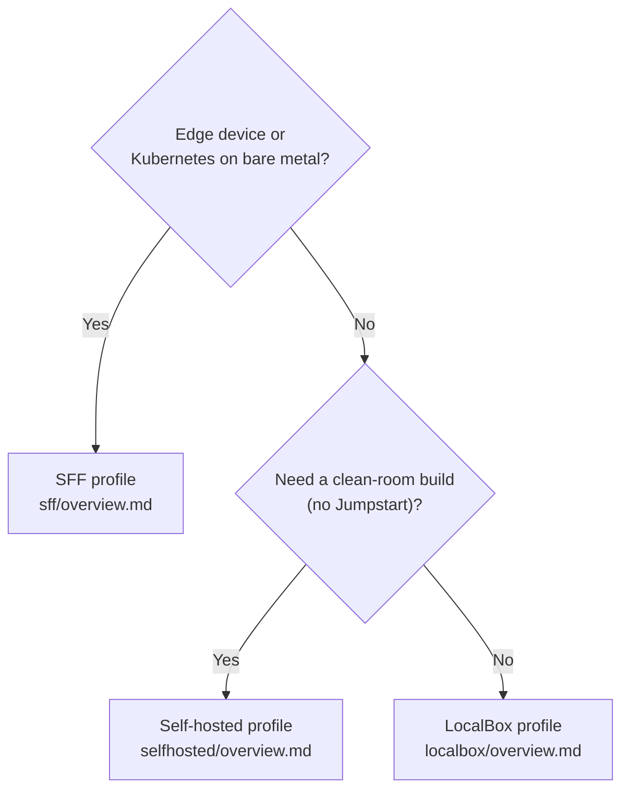

# Choose a profile

[Documentation home](README.md) / Choose a profile

apex-localops ships three evaluation profiles. They all build a nested Azure Local environment
inside a single Azure VM, but they differ in how they are built, what they produce, and what
they cost. Use this guide to pick one, then follow its quickstart.

## Decision guide

Answer these in order and stop at the first match:

1. **Do you need an edge or Small Form Factor device, or a Kubernetes-on-bare-metal target?**
   Use the **SFF profile**. It is the lightest and cheapest option and is the only path to AKS
   on bare metal. Start with the [SFF overview](sff/overview.md).
2. **Do you need a clean-room build with no Arc Jumpstart dependency** — for example, for a
   sovereign, restricted, or audit-sensitive environment? Use the **Self-hosted profile**. You
   stage the OS ISOs yourself and no prebaked Jumpstart images are used. Start with the
   [Self-hosted overview](selfhosted/overview.md).
3. **Otherwise, do you want the fastest path to a working cluster?** Use the **LocalBox
   profile**. It builds the nested cluster from Arc Jumpstart artifacts with the least manual
   work. Start with the [LocalBox overview](localbox/overview.md).

**Diagram key:** each decision routes to one profile overview. Follow the first branch that
matches your scenario.

## Side-by-side comparison

| Dimension | LocalBox | Self-hosted | SFF |
| --- | --- | --- | --- |
| **Nested payload** | 2- or 3-node Azure Local cluster + management host | 3-node cluster + domain controller + router VM | 1 or 2 edge test VMs (Maintenance OS / ROE) |
| **Build source** | Prebaked Arc Jumpstart VHDs and modules | Operator-staged OS ISOs (clean-room) | Microsoft-owned ROE ISO + Configurator App |
| **Manual steps** | None — fully automated after deploy | One: download and upload two ISOs | One-time ISO staging, then one provisioning step |
| **Azure VMs** | 1 host (+ optional jumpbox) | 2 (cluster host + jumpbox) | 1 host (+ optional jumpbox) |
| **Default host SKU** | `Standard_E64s_v6` (64 vCPU / 512 GB) | `Standard_E64s_v6` (64 vCPU / 512 GB) | `Standard_D16s_v5` (2 VMs, default) or `Standard_D8s_v5` (1 VM) |
| **Default region** | `swedencentral` (infra) + `westeurope` (instance) | `swedencentral` (infra) + `westeurope` (instance) | `swedencentral` (host) + `eastus` (Azure Local + AKS) |
| **Time to first result** | ~4–5 h in-VM build | Half-day (first run) | ~10–15 min deploy + nested build |
| **Est. cost (24×7)** | ~$7,850/mo | ~$7,850/mo | ~$700–900/mo |
| **AKS on bare metal** | Not applicable | Not applicable | Supported (preview) |
| **Jumpstart dependency** | Yes (vendored) | None | None |
| **Status** | Stable | Stable | Preview |

## What each profile is for

### LocalBox

The fastest way to a working nested Azure Local cluster. It packages the Arc Jumpstart
LocalBox sandbox, so the in-VM build runs unattended and produces a 3-node cluster with a
domain controller, a router, and Windows Admin Center. Choose it for a quick, full-featured
evaluation when a Jumpstart-based build is acceptable.

Go to the [LocalBox overview](localbox/overview.md).

### Self-hosted

The same nested cluster, built without any Arc Jumpstart images or modules. You stage the
Azure Local and Windows Server ISOs into a hardened storage account, and the host converts
them to bootable disks and builds the router, the domain controller, the nodes, and the
cluster from first principles. Choose it when you need a transparent, dependency-free build.

Go to the [Self-hosted overview](selfhosted/overview.md).

### Small Form Factor (SFF)

A lightweight edge profile at roughly one-tenth the cost. It builds a single nested
Maintenance OS (ROE) test VM and drives it to a successful setup, then lets you provision the
machine into Azure and, optionally, deploy AKS on bare metal onto it. Choose it to evaluate
edge and Kubernetes-on-bare-metal scenarios.

Go to the [SFF overview](sff/overview.md).

## Common ground

All three profiles share the same operating model:

- They deploy into a **Bastion-only** resource group with **no public IP** on the VMs.
- They route outbound traffic through a **NAT Gateway**.
- They register the required **resource providers** with a bundled `check-providers` script.
- They enable **Azure Hybrid Benefit** by default to remove the Windows licensing surcharge.
- They expose the build through **resource-group progress tags**, so the `monitor` scripts
  track it without signing in to the VM.
- They bill for **disks, Bastion, and NAT even when stopped** — delete the resource group to
  reach $0.

## Next steps

- Pick a profile and open its overview: [LocalBox](localbox/overview.md) ·
  [Self-hosted](selfhosted/overview.md) · [SFF](sff/overview.md).
- Unsure about a term? See the [Glossary](glossary.md).

---

[Documentation home](README.md) · [Glossary](glossary.md)
