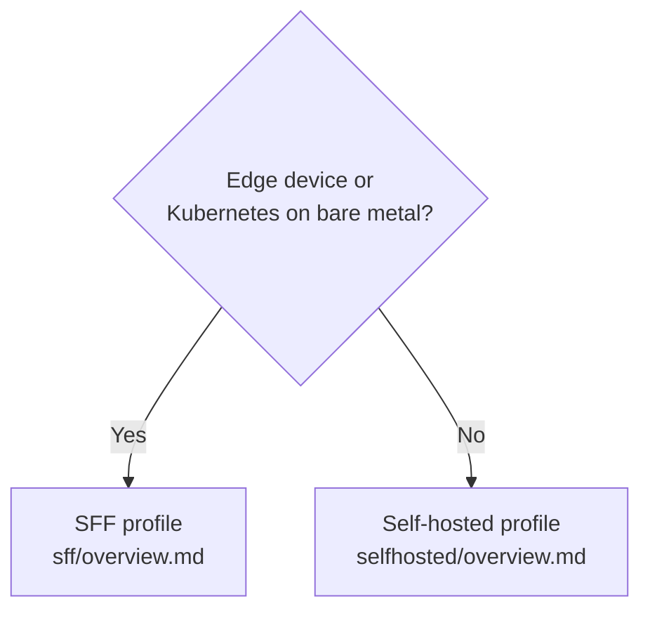

# Choose a profile

[Documentation home](README.md) / Choose a profile

apex-localops ships two evaluation profiles. They both build a nested Azure Local environment
inside a single Azure VM, but they differ in how they are built, what they produce, and what
they cost. Use this guide to pick one, then follow its quickstart.

## Decision guide

Answer these in order and stop at the first match:

1. **Do you need an edge or Small Form Factor device, or a Kubernetes-on-bare-metal target?**
   Use the **SFF profile**. It is the lightest and cheapest option and is the only path to AKS
   on bare metal. Start with the [SFF overview](sff/overview.md).
2. **Otherwise, do you want a full nested Azure Local cluster?** Use the **Self-hosted
   profile**. It builds the cluster clean-room from OS ISOs you stage yourself — no prebaked
   Arc Jumpstart images or modules — which suits sovereign, restricted, or audit-sensitive
   environments. Start with the [Self-hosted overview](selfhosted/overview.md).

```mermaid
flowchart TD
    Q1{"Edge device or<br/>Kubernetes on bare metal?"}
    Q1 -->|Yes| SFF["SFF profile<br/>sff/overview.md"]
    Q1 -->|No| SELF["Self-hosted profile<br/>selfhosted/overview.md"]
```

**Diagram key:** each decision routes to one profile overview. Follow the first branch that
matches your scenario.

## Side-by-side comparison

| Dimension | Self-hosted | SFF |
| --- | --- | --- |
| **Nested payload** | 3-node cluster + domain controller + router VM | 1 or 2 edge test VMs (Maintenance OS / ROE) |
| **Build source** | Operator-staged OS ISOs (clean-room) | Microsoft-owned ROE ISO + Configurator App |
| **Manual steps** | One: download and upload two ISOs | One-time ISO staging, then one provisioning step |
| **Azure VMs** | 2 (cluster host + jumpbox) | 1 host (+ optional jumpbox) |
| **Default host SKU** | `Standard_E64s_v6` (64 vCPU / 512 GB) | `Standard_D16s_v5` (2 VMs, default) or `Standard_D8s_v5` (1 VM) |
| **Default region** | `swedencentral` (infra) + `canadacentral` (instance) | `swedencentral` (host) + `eastus` (Azure Local + AKS) |
| **Time to first result** | Half-day (first run) | ~10–15 min deploy + nested build |
| **Est. cost (40-h week)** | ~$563 | ~$151 |
| **AKS on bare metal** | Not applicable | Supported (preview) |
| **Jumpstart dependency** | None | None |
| **Status** | Primary | Preview |

## What each profile is for

### Self-hosted

A full nested Azure Local cluster, built without any Arc Jumpstart images or modules. You stage
the Azure Local and Windows Server ISOs into a hardened storage account, and the host converts
them to bootable disks and builds the router, the domain controller, the nodes, and the cluster
from first principles. Choose it for a transparent, dependency-free full-cluster evaluation.

Go to the [Self-hosted overview](selfhosted/overview.md).

### Small Form Factor (SFF)

A lightweight edge profile at roughly a quarter of the cost. It builds a single nested
Maintenance OS (ROE) test VM and drives it to a successful setup, then lets you provision the
machine into Azure and, optionally, deploy AKS on bare metal onto it. Choose it to evaluate
edge and Kubernetes-on-bare-metal scenarios.

Go to the [SFF overview](sff/overview.md).

## Common ground

All three profiles share the same operating model:

- They deploy into a **Bastion-only** resource group with **no public IP** on the VMs.
- They route outbound traffic through a **NAT Gateway**.
- They register the required **resource providers** with a bundled `check-providers` script.
- They enable **Azure Hybrid Benefit** by default to remove the Windows licensing surcharge.
- They expose the build through **resource-group progress tags**, so the `monitor` scripts
  track it without signing in to the VM.
- They bill for **disks, Bastion, and NAT even when stopped** — delete the resource group to
  reach $0.

## Next steps

- Pick a profile and open its overview: [Self-hosted](selfhosted/overview.md) ·
  [SFF](sff/overview.md).
- Unsure about a term? See the [Glossary](glossary.md).

---

[Documentation home](README.md) · [Glossary](glossary.md)
