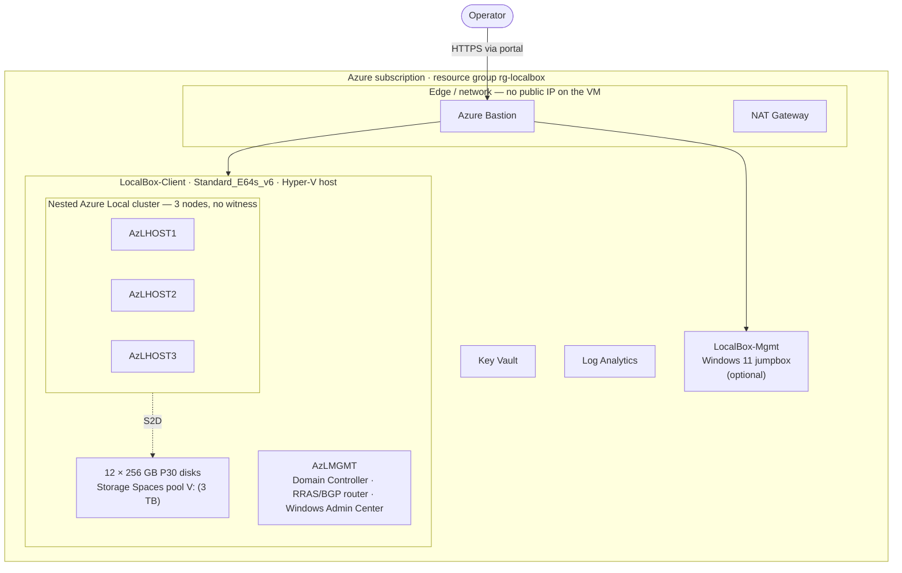

# LocalBox overview

[Documentation home](../README.md) / LocalBox / Overview

The LocalBox profile builds a nested Azure Local cluster inside a single Azure VM, using the
vendored Arc Jumpstart LocalBox sandbox. It is the fastest way to a full, working evaluation
cluster: after the deployment, the in-VM build runs unattended and produces a 3-node cluster
with a domain controller, a router, and Windows Admin Center.

This page explains what the profile builds and when to use it. To deploy, go to the
[LocalBox quickstart](quickstart.md).

## When to use this profile

Choose LocalBox when you want a complete Azure Local cluster with the least manual effort and a
Jumpstart-based build is acceptable. If you need a clean-room build with no Jumpstart
dependency, use the [Self-hosted profile](../selfhosted/overview.md) instead. If you want a
lighter, cheaper edge device, use the [SFF profile](../sff/overview.md). For a full comparison,
see [Choose a profile](../choose-a-profile.md).

## Architecture

The profile deploys one Hyper-V host VM and builds the entire cluster inside it as nested VMs.
The operator reaches the host only through Azure Bastion; the VMs have no public IP.

**Diagram key:** solid arrows are network paths through Azure Bastion; the dotted arrow is the
Storage Spaces Direct (S2D) data path that pools the host's 12 data disks into the `V:` drive
where the nested VMs live.

## What it deploys

The default 3-node profile creates:

- A `LocalBox-Client` Hyper-V host VM (`Standard_E64s_v6`, 64 vCPU / 512 GB) with 12 × 256 GB
  P30 data disks pooled into a 3 TB `V:` drive.
- Three nested cluster nodes (`AzLHOST1`, `AzLHOST2`, `AzLHOST3`) with no witness, plus a
  management host (`AzLMGMT`) that runs the domain controller, the RRAS/BGP router, and
  Windows Admin Center.
- A virtual network, a network security group (NSG), Azure Bastion, a NAT Gateway, a Key
  Vault, a Log Analytics workspace, and an optional Windows 11 jumpbox.

For the full SKU, disk, and cost breakdown, and the 2- vs 3-node rationale, see
[LocalBox sizing and cost](sizing.md).

## How the build works

1. The Azure Resource Manager (ARM) deployment finishes in about 18 minutes.
2. The host VM runs `Bootstrap.ps1`, installs Hyper-V, and reboots.
3. Because auto-logon is on by default, the cluster-build script starts on its own — no sign-in
   required — and runs for about 4–5 hours.
4. The `monitor.sh` script tracks progress through resource-group tags and the
   `Microsoft.AzureStackHCI/clusters` resource, without signing in to the VM.

The orchestration is fully vendored in this repo, so the deployment has no runtime dependency
on the upstream `microsoft/azure_arc` repository. A few large, Microsoft-owned binaries (the OS
images, PowerShell 7, Windows Admin Center, and the desktop wallpaper) are downloaded from
their official sources at build time.

## Provenance

LocalBox is derived from the Arc Jumpstart LocalBox sandbox in
[`microsoft/azure_arc`](https://github.com/microsoft/azure_arc) and is distributed under
CC BY 4.0. See [ATTRIBUTION.md](../../ATTRIBUTION.md) for the full credit and the list of
changes made in this repository.

## Next steps

- Deploy the cluster: [LocalBox quickstart](quickstart.md).
- Plan capacity and cost first: [LocalBox sizing and cost](sizing.md).
- Hit a problem? [LocalBox troubleshooting](troubleshooting.md).

---

[Documentation home](../README.md) · [Choose a profile](../choose-a-profile.md) · [Glossary](../glossary.md)
