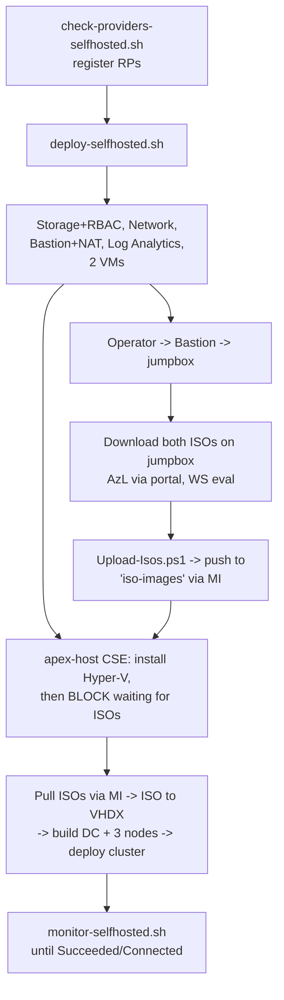

# Plan: Self-hosted Jumpstart for Azure Local (no external VHDs)

A new self-contained profile (`azlocal-selfhosted`): two Azure VMs (mgmt/jumpbox + cluster-host), Bastion + NAT Gateway, Log Analytics, and a hardened storage account for both ISOs. The operator downloads both ISOs **from the jumpbox** and uploads them to storage; the cluster-host waits for them, pulls via managed identity, converts each ISO→VHDX in-VM, and builds the nested DC + 3-node cluster with our own `ApexLocalOps` module.

> **Success criterion (locked): ZERO dependency on Jumpstart.** No prebaked Jumpstart VHDs, no `Azure.Arc.Jumpstart.*` PowerShell modules, and no vendored Jumpstart scripts in the final result. **Chosen path: clean-room reimplementation** (the vendor/fork alternative was explicitly rejected). Consequence: the Arc bootstrap, intent-based fabric networking, router/gateway, AD object pre-creation, environment checks, and time-sync are **owned build scope** — features we implement, not logic we inherit.

## Operator flow

## Steps

### Phase 0 — Scaffolding *(quick)*
1. Create `infra/bicep/azlocal-selfhosted/` + `artifacts/selfhosted/` trees and `ApexLocal-Config.psd1` (domain `jumpstart.local`, internal `192.168.1.0/24`, node count, IP block).

### Phase 1 — Bicep infrastructure *(parallel with Phase 3 authoring; build + validate this first)*
2. `mgmt/stagingStorage.bicep` — adapt [infra/bicep/azlocal-sff/mgmt/stagingStorage.bicep](infra/bicep/azlocal-sff/mgmt/stagingStorage.bicep): StorageV2, no public blob, HTTPS-only/TLS1.2; containers `iso-images` + `logs`. **3 role assignments**: `deployer().objectId`→Blob Data Owner; both VM MIs→Blob Data Contributor.
3. `network/network.bicep` — adapt [infra/bicep/azlocal-js/network/network.bicep](infra/bicep/azlocal-js/network/network.bicep): VNet `172.16.0.0/16`, workload subnet, `AzureBastionSubnet`, Bastion (Standard), NAT Gateway + static PIP, closed inbound NSG.
4. `mgmt/mgmtArtifacts.bicep` — Log Analytics (pergb2018) + AMA/DCR on both VMs, per [infra/bicep/azlocal-js/mgmt/mgmtArtifacts.bicep](infra/bicep/azlocal-js/mgmt/mgmtArtifacts.bicep).
5. `mgmt/mgmtVm.bicep` — `apex-mgmt` jumpbox (D4s_v5, WS2025 Marketplace, MI, Bastion target, no public IP).
6. `host/host.bicep` — `apex-host` (E64s_v6 / E32s_v6, WS2025 Marketplace, 12×P30 + 1024GB OS, MI, CustomScriptExtension); reuse CSE + disk-loop from [infra/bicep/azlocal-js/host/host.bicep](infra/bicep/azlocal-js/host/host.bicep).
7. `main.bicep` + `main.bicepparam` — orchestrate modules, pass storage/LA refs + MI principalIds for RBAC.

### Phase 2 — Staging & orchestration scripts
8. `artifacts/selfhosted/PowerShell/Upload-Isos.ps1` — runs **on the jumpbox**; uploads operator-downloaded ISOs to `iso-images` via MI (idempotent, hash check). Optional thin `scripts/stage-isos-selfhosted.sh` wrapper.
9. `scripts/{check-providers,deploy,monitor,cleanup}-selfhosted.sh` — mirror [scripts/deploy.sh](scripts/deploy.sh) + [scripts/monitor.sh](scripts/monitor.sh).

### Phase 3 — In-VM bootstrap + `ApexLocalOps` module *(validate the ISO→VHDX pipeline before the full nested build)*
10. `Bootstrap.ps1` — install Hyper-V/PS7/Az, fetch `ApexLocalOps`, autologon, schedule build, reboot.
11. `Get-StagedIso` — **poll + wait** for both ISOs in `iso-images` (timeout-guarded), pull via MI, verify (SFF "host waits for staged artifacts" pattern).
12. `Convert-IsoToVhdx` — DISM `install.wim`→bootable Gen2 VHDX, used for **both** Azure Local nodes and the WS DC base.
13. `New-HostVirtualSwitch` (internal vSwitch + NAT for `192.168.1.0/24`).
14. `New-NestedVMFromVhdx` — Gen2 VM, differencing disk, offline `unattend.xml` injection, TPM/vCPU/RAM.
15. `New-DomainControllerVM` — `Install-ADDSForest`, create deployment OU, AD object pre-creation.
16. `New-AzLocalNodeVM` ×3 + `Set-NodeArcRegistration` (`azcmagent connect` via PowerShell Direct).

### Phase 4 — Cluster deployment *(depends on Phase 3)*
17. `Invoke-AzureLocalClusterDeploy` — build params (arcNodeResourceIds, `hciResourceProviderObjectID`, domainFqdn, adouPath, IP block) and run validate→deploy via [artifacts/azlocal.json](artifacts/azlocal.json), reusing param logic from [artifacts/PowerShell/Generate-ARM-Template.ps1](artifacts/PowerShell/Generate-ARM-Template.ps1).

### Phase 5 — Documentation *(parallel)*
18. `docs/selfhosted-quickstart.md` (incl. the manual jumpbox ISO step), `selfhosted-sizing.md`, `selfhosted-architecture.md` (Mermaid topology).

## Relevant files
- `infra/bicep/azlocal-selfhosted/mgmt/stagingStorage.bicep` — ISOs + 3 role assignments (deployer Owner; 2 VM MIs Contributor).
- `infra/bicep/azlocal-selfhosted/{network,mgmt,host}/**`, `main.bicep` — new profile.
- `artifacts/selfhosted/PowerShell/ApexLocalOps/**`, `Upload-Isos.ps1` — self-contained logic + jumpbox uploader.
- [infra/bicep/azlocal-sff/mgmt/stagingStorage.bicep](infra/bicep/azlocal-sff/mgmt/stagingStorage.bicep), [artifacts/azlocal.json](artifacts/azlocal.json), [scripts/deploy.sh](scripts/deploy.sh) — reuse references.

## Verification
1. `az bicep build` (clean); `bash -n` + `shellcheck` on scripts.
2. `az deployment group what-if` shows storage + 3 role assignments + 2 VMs + network + LA.
3. `az role assignment list --scope <storage>` confirms deployer=Blob Data Owner, both VM MIs=Blob Data Contributor.
4. In-VM "no external VHD" proof: logs show both ISOs pulled from the storage account; **no** request to `jumpstartprodsg.blob`/`azlocalvhds.blob`; `Get-VM` shows DC + 3 nodes.
5. End-to-end: `monitor-selfhosted.sh` → `az stack-hci cluster list` = `Succeeded`/`Connected`; `az deployment group list` validate+deploy Succeeded.

## Decisions (locked)
- **Clean-room reimplementation; zero Jumpstart dependency** (no prebaked VHDs, no `Azure.Arc.Jumpstart.*` modules, no vendored Jumpstart scripts). Vendor/fork path rejected.
- Both ISOs manually downloaded on the jumpbox and uploaded to storage; host **waits** for them before building.
- Both VM managed identities = **Storage Blob Data Contributor** (jumpbox uploads; host reads ISOs + writes logs); deployer = **Storage Blob Data Owner**.
- Both nested base images (DC + nodes) come from ISOs via DISM — no marketplace-for-nested, no Jumpstart blob.
- Azure VMs boot from Marketplace WS2025; DC nested on the cluster-host; mgmt VM = orchestration/jumpbox only.
- Build + validate Phases 1–3 before the full nested build.

## Owned build scope (consequence of clean-room choice)
These are NOT avoidable by staging ISOs; they must be implemented from scratch in `ApexLocalOps` because we are not inheriting Jumpstart's logic:
- **Arc deployment bootstrap** — install/stage the mandatory cluster-deploy extensions (LifecycleManager, DeviceManagement, TelemetryAndDiagnostics) + deploy prereqs (the equivalent of `Invoke-AzureEdgeBootstrap` / `Set-AzLocalDeployPrereqs`). `azcmagent connect` alone is insufficient.
- **Intent-based fabric networking** — multi-NIC management/compute + (switchless) storage intents, not a single flat `192.168.1.0/24` switch.
- **Router/gateway + DNS forwarding** — replacement for the dropped Router VM that the fabric/DNS path depends on.
- **AD object pre-creation + environment checks** — re-implement (or accept these specific helpers are external) since the PSGallery tools are a Jumpstart-adjacent dependency.
- **Time sync** — DC as NTP-authoritative; disable Hyper-V time integration on the DC; guard nested clock drift.
- **Node imaging** — producing a Secure-Boot/TPM-bootable Azure Local node from ISO (DISM path is currently unproven in this repo; boot-from-ISO + `autounattend` is the proven in-repo alternative if DISM stalls).
- **RG-level RBAC for the in-VM deploy** — the host identity needs Contributor + User Access Administrator on the RG (the create-cluster path performs role assignments), beyond storage data access.

## Target architecture (reference)
- VNet `172.16.0.0/16`; workload subnet `172.16.1.0/24`; `AzureBastionSubnet` `172.16.3.64/26`.
- Bastion (Standard) + NAT Gateway (static PIP) egress; no public IPs; closed inbound NSG.
- Log Analytics workspace + AMA/DCR on both VMs.
- Storage account (hardened) containers `iso-images` (`AzureLocalOS.iso` + `WindowsServer.iso`) + `logs`.
- `apex-mgmt`: Standard_D4s_v5, WS2025 marketplace, MI, Bastion target, tooling + monitor only.
- `apex-host`: Standard_E64s_v6 (3-node) / E32s_v6 (2-node), WS2025 marketplace, 12× P30 256GB data + 1024GB OS, MI, CustomScriptExtension self-bootstrap.
- Nested on host: DC (`jumpstart.local`, `192.168.1.254`) + 3× Azure Local nodes (96GB each) on internal vSwitch + NAT `192.168.1.0/24`.

## Feasibility notes (web-verified 2026-06-11)
- Azure Local OS ISO is **portal-gated** (sign-in + `Microsoft.AzureStackHCI` RP + subscription + license accept); no anonymous direct URL. Hence the manual jumpbox download + upload model.
- Cluster deploy is documented ARM (`microsoft.azurestackhci/create-cluster`): needs Arc-registered nodes (`arcNodeResourceIds`), `hciResourceProviderObjectID` (app `1412d89f-b8a8-4111-b4fd-e82905cbd85d`), `domainFqdn` + `adouPath` (AD OU pre-created), `startingIPAddress`/`endingIPAddress` (≥6 contiguous IPs). [artifacts/azlocal.json](artifacts/azlocal.json) already mirrors this — reusable.
- Marketplace images cannot seed nested VMs, so the nested DC base also comes from the Windows Server ISO via DISM (same path as the Azure Local nodes).
