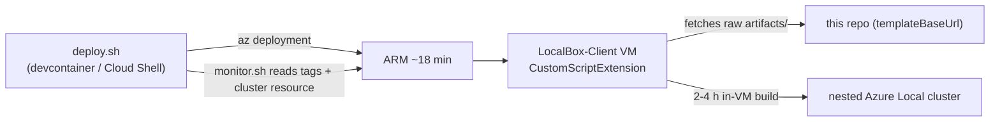
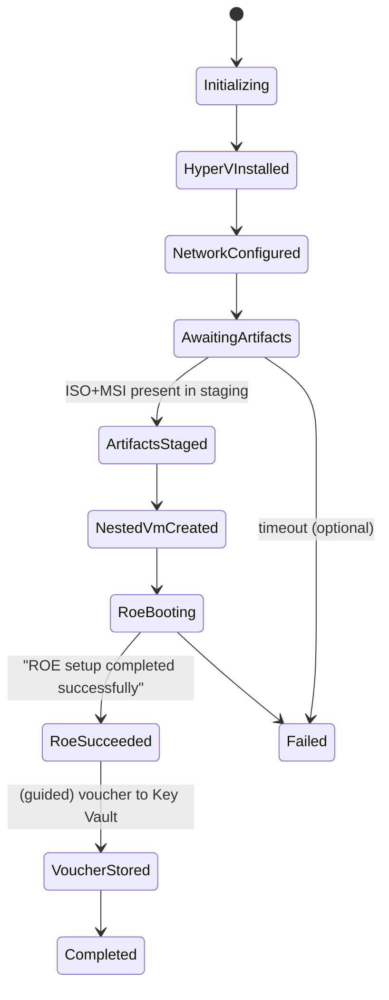

# Plan: add Azure Local **Small Form Factor (SFF)** support to apex-localops

> [!NOTE]
> **Internal design document.** This is a retained engineering plan and milestone record, not a
> user-facing guide. For deployment instructions, start at the [SFF overview](../sff/overview.md).

> Status: **IMPLEMENTED**. All milestones (M1–M5) are built and validated; this document is
> retained as the design rationale and milestone record. For usage, see the
> [SFF quickstart](../sff/quickstart.md), [runbook](../sff/runbook.md), and
> [zero-touch guide](../sff/zero-touch.md). The zero-touch chain further automates the voucher
> and machine-provisioning steps that this plan originally scoped as guided.
>
> Preview note: Azure Local SFF is in **PREVIEW** (`azloc-2605`). APIs, portal flows, and
> artifact names will change. The design isolates the volatile pieces (ROE ISO acquisition,
> Configurator App, ownership voucher) behind clear seams so churn stays contained.

---

## Table of contents

1. [Goal & non-goals](#1-goal--non-goals)
2. [Decisions locked in](#2-decisions-locked-in)
3. [How LocalBox works today (the pattern we mirror)](#3-how-localbox-works-today-the-pattern-we-mirror)
4. [The canonical SFF install flow (from Microsoft Learn)](#4-the-canonical-sff-install-flow-from-microsoft-learn)
5. [Design principles](#5-design-principles)
6. [Target architecture](#6-target-architecture)
7. [The artifact-staging seam (Option A, Azure-initiated)](#7-the-artifact-staging-seam-option-a-azure-initiated)
8. [Network design](#8-network-design)
9. [The nested SFF test VM specification](#9-the-nested-sff-test-vm-specification)
10. [Repository layout (new files)](#10-repository-layout-new-files)
11. [Bicep module specifications](#11-bicep-module-specifications)
12. [In-VM automation specifications](#12-in-vm-automation-specifications)
13. [Orchestration script specifications](#13-orchestration-script-specifications)
14. [Observability & milestone tags](#14-observability--milestone-tags)
15. [Guided handoff runbook (voucher + portal provisioning)](#15-guided-handoff-runbook-voucher--portal-provisioning)
16. [Phased milestones & acceptance criteria](#16-phased-milestones--acceptance-criteria)
17. [Docs vendoring (sparse sync, not subtree)](#17-docs-vendoring-sparse-sync-not-subtree)
18. [Sizing & cost](#18-sizing--cost)
19. [Security considerations](#19-security-considerations)
20. [Testing & validation plan](#20-testing--validation-plan)
21. [Risks & mitigations](#21-risks--mitigations)
22. [Open questions & future work](#22-open-questions--future-work)
23. [Appendix A — exact nested-VM PowerShell](#appendix-a--exact-nested-vm-powershell)
24. [Appendix B — provider & feature registration](#appendix-b--provider--feature-registration)
25. [Appendix C — references](#appendix-c--references)

---

## 1. Goal & non-goals

### Goal

Add a **second deployment profile** to apex-localops that stands up an Azure Local **Small
Form Factor (SFF)** *test* environment inside a single Azure VM — no physical edge hardware
— using the same "nested-virtualization host + NAT Gateway + Bastion-only + as-much-
automation-as-possible" approach already proven by the LocalBox profile.

Concretely, the automation must **guarantee by construction** the four-point success gate
from the Microsoft Learn "Review your VM setup" checklist:

| Success-gate item | Guaranteed by |
| --- | --- |
| VM is **Generation 2** | `New-VM -Generation 2` |
| **TPM enabled** | `Set-VMKeyProtector` + `Enable-VMTPM` |
| **Secure Boot disabled** | `Set-VMFirmware -EnableSecureBoot Off` |
| **≥ 4 virtual processors** | `Set-VMProcessor -Count 4` |
| VM **booted the Maintenance OS (ROE)** | boot the ROE ISO, poll console/serial for `ROE setup completed successfully`, emit `SffProgress=RoeSucceeded` tag |
| **Ownership voucher downloaded & stored securely** | Configurator App on the host downloads the `.pem`; helper uploads it to Key Vault (Azure-side) |

### Non-goals

- **Production SFF.** Microsoft does not support SFF-on-VM for production; this is an
  evaluation analogue (exactly like LocalBox is for clusters). Real fleets must run on
  [validated devices](#appendix-c--references) (ASUS NUC 14/15 Pro, Lenovo ThinkEdge
  SE30/SE100, OnLogic HX521).
- **Redistributing Microsoft binaries.** The ROE Maintenance OS ISO and the Configurator
  App MSI are Microsoft-owned, multi-GB, and portal/subscription-gated. They are **not**
  vendored into this repo (same boundary already documented in
  [ATTRIBUTION.md](../../ATTRIBUTION.md)).
- **Replacing the LocalBox profile.** SFF is additive. The existing
  [infra/bicep/azlocal-js](../../infra/bicep/azlocal-js) tree and
  [scripts/](../../scripts) are untouched except for shared, backward-compatible refactors.

---

## 2. Decisions locked in

These were confirmed before planning:

1. **ISO / Configurator acquisition → Option A**, with the constraint that **all downloads
   must be initiated from resources located in Azure** (never the operator's local
   laptop). See [§7](#7-the-artifact-staging-seam-option-a-azure-initiated). One-time manual
   portal fetch *from an Azure VM / Cloud Shell*; everything after is automated.
2. **Docs → sparse-vendor only** the `small-form-factor` folder from
   [`MicrosoftDocs/azure-stack-docs`](https://github.com/MicrosoftDocs/azure-stack-docs).
   **Drop `azure-sovereign-clouds`** (it contains no SFF content). No full `git subtree`.
   See [§17](#17-docs-vendoring-sparse-sync-not-subtree).
3. **Scope** → automation stops at a **ROE-ready nested VM** (the four-point checklist);
   the ownership voucher + Azure-portal machine-provisioning is a **guided runbook**. An
   `az`-driven Arc-site provisioning path is included as an **optional** later milestone
   (M6), not on the critical path.
4. **Naming** → resource group `rg-localsff`, resource prefix `LocalSFF-*`, IaC under
   `infra/bicep/azlocal-sff/`, in-VM artifacts under `artifacts/sff/`. (Adjustable; this is
   the working convention used throughout this plan.)

---

## 3. How LocalBox works today (the pattern we mirror)

Understanding the existing profile is essential because SFF reuses ~70% of it.



Key mechanics, with the real files:

- **Orchestrator Bicep** [infra/bicep/azlocal-js/main.bicep](../../infra/bicep/azlocal-js/main.bicep)
  wires modules: network, staging storage, host, optional Win11 jumpbox, customer-usage
  attribution.
- **Network** [network/network.bicep](../../infra/bicep/azlocal-js/network/network.bicep):
  `172.16.0.0/16` VNet, workload subnet `172.16.1.0/24`, NSG, **NAT Gateway** (egress, no
  public IP on the VM when Bastion is on), **Azure Bastion** in `172.16.3.64/26`.
  `defaultOutboundAccess: false` forces all egress through the NAT Gateway.
- **Host** [host/host.bicep](../../infra/bicep/azlocal-js/host/host.bicep): big nested-virt VM,
  pre-created P30 data disks, a **system-assigned managed identity** granted **Owner** +
  **Key Vault Administrator** + **Storage Account Contributor** on the RG, and a
  `Microsoft.Compute/virtualMachines/extensions` **CustomScriptExtension** named
  `Bootstrap` that runs [artifacts/PowerShell/Bootstrap.ps1](../../artifacts/PowerShell/Bootstrap.ps1).
- **In-VM bootstrap** [Bootstrap.ps1](../../artifacts/PowerShell/Bootstrap.ps1) sets machine
  env vars, configures **autologon** (so the long build starts headless after the Hyper-V
  reboot), downloads the PS profile + config, and hands off to the logon script.
- **Logon script** [LocalBoxLogonScript.ps1](../../artifacts/PowerShell/LocalBoxLogonScript.ps1)
  does `Connect-AzAccount -Identity`, removes the autologon keys, and performs the real
  build. The managed identity is how the in-VM script talks back to Azure with **no secrets
  on disk**.
- **Tooling** [scripts/deploy.sh](../../scripts/deploy.sh) (preflight → what-if → deploy →
  hand off to monitor), [scripts/monitor.sh](../../scripts/monitor.sh) (reads RG tags +
  cluster resource + optional in-VM log tail via `az vm run-command`),
  [scripts/check-providers.sh](../../scripts/check-providers.sh) (idempotent provider
  registration + resolves `spnProviderId`), [scripts/cleanup.sh](../../scripts/cleanup.sh).
- **Secret hygiene**: the Windows password is read from `LOCALBOX_ADMIN_PASSWORD` via
  `readEnvironmentVariable()` in [main.bicepparam](../../infra/bicep/azlocal-js/main.bicepparam);
  identity GUIDs are resolved at runtime by `deploy.sh`. **Nothing sensitive is committed.**

SFF keeps every one of these mechanics. What changes is the *payload* the host builds: a
single nested **ROE test VM** instead of a 3-node cluster, and the *source* of the payload
(portal-gated ISO instead of public OS VHDX URLs).

---

## 4. The canonical SFF install flow (from Microsoft Learn)

The official end-to-end (links in [Appendix C](#appendix-c--references)), annotated with
**[AUTO]** = we automate it, **[GUIDED]** = operator does it via runbook, **[PORTAL]** =
inherently Azure-portal in this preview:

1. **Subscription setup** — register the **`Microsoft.DeviceOnboarding` / `AzureLocalZTP`**
   feature + the SFF resource-provider set; confirm Owner (or Contributor + RBAC Admin);
   prepare a Microsoft **Entra security group** of machine operators. **[AUTO]** via
   `check-providers-sff.sh` (RBAC/Entra group = **[GUIDED]**).
2. **Install Hyper-V** on a Windows host with nested-virt. **[AUTO]** (host is an Azure VM;
   CSE installs the Hyper-V role).
3. **Download the ROE ISO + Configurator App** from *Azure Arc → Operations → Machine
   provisioning (preview) → Get started → View downloads → Download all*. **[GUIDED +
   PORTAL]**, initiated from an **Azure** resource → staged to the staging storage account
   ([§7](#7-the-artifact-staging-seam-option-a-azure-initiated)).
4. **Create the virtual network** — internal Hyper-V switch + NAT + DHCP via the vendored
   `set-network.ps1` (idempotent; `HV-Internal-NAT`). **[AUTO]**.
5. **Azure-VM IMDS workaround** — block `169.254.169.254` in/out on the nested VM's adapter
   *before first boot* so it can't grab the host's managed identity. **[AUTO]**.
6. **Create the Gen2 VM** — 16000 MB RAM, `HV-Internal-NAT` switch, 256 GB VHD, boot from
   the ROE ISO. **[AUTO]**.
7. **Update VM settings** — **clear Secure Boot**, **enable TPM**, **≥ 4 vCPU**. **[AUTO]**.
8. **Boot & confirm ROE** — start, wait ~5 min, console shows
   `[Succeeded] ROE setup completed successfully`. **[AUTO]** (poll + tag).
9. **Download the ownership voucher** — Configurator App → nested VM IP → `edgeuser` /
   `Password1` → **Download Ownership Voucher** → `.pem`. **[GUIDED]** on the host (only the
   host has line-of-sight to the nested VM's `192.168.200.x` IP); helper stores the `.pem`
   in Key Vault.
10. **Connect the provisioned machine from the portal** — Arc → Machine provisioning →
    create **site**, configure **SSH keys**, **add machine via ownership voucher**, OS =
    **Azure Linux 2604**, wait (~25 min) → **Provisioned** → SSH. **[GUIDED + PORTAL]**
    (optional **[AUTO]** in M6 via `az`).
11. **Run workloads** — `setup-k3s-arc.sh` for K3s/Arc, or containerized/IoT workloads.
    **[GUIDED]** (vendored script).

> The success gate this project targets is **step 8 + step 9** (ROE-ready VM with voucher
> secured). Steps 10–11 are documented and optionally automated, but are downstream of the
> preview's portal-centric machine-provisioning experience.

---

## 5. Design principles

- **P1 — All downloads initiated from Azure resources.** The operator never downloads the
  ROE ISO or Configurator App to a local laptop. The portal "Download all" is performed
  from an **Azure jumpbox** (over Bastion) or **Azure Cloud Shell**, landing the bits in
  the **staging storage account**. The host then pulls from staging via its **managed
  identity**. Egress is via the **NAT Gateway** only. (This is the explicit constraint from
  the decision in [§2](#2-decisions-locked-in).)
- **P2 — Mirror LocalBox, don't reinvent.** Reuse the network + jumpbox + managed-identity
  + tags-as-progress + monitor pattern verbatim. New code is limited to the SFF-specific
  payload.
- **P3 — Secrets never on disk / never in git.** Same `readEnvironmentVariable()` +
  runtime-resolved-identity model as today. The ownership voucher lives only in Key Vault.
- **P4 — Idempotent & resumable.** The in-VM build is a scheduled task that **polls for
  staged artifacts** and converges; re-running `set-network.ps1` or the VM-build script is
  safe (matches the upstream script's idempotency contract).
- **P5 — Isolate preview volatility.** The ISO name, Configurator behaviour, voucher format,
  and portal provisioning are quarantined in `Stage-SffArtifacts.ps1` + the runbook + the
  vendored-doc pin, so a preview revision is a localized change.
- **P6 — Observable without RDP.** Progress is legible from `az` alone (RG tags + optional
  host log tail), exactly like [monitor.sh](../../scripts/monitor.sh) today.

---

## 6. Target architecture

```mermaid
flowchart TB
    User(["Operator"])
    CS["Azure Cloud Shell<br/>(alt. acquisition path)"]

    subgraph RG["resource group rg-localsff"]
        direction TB

        subgraph Edge["Edge / network — no public IP on the VMs"]
            Bastion["Azure Bastion"]
            NAT["NAT Gateway"]
        end

        KV["Key Vault<br/>ownership voucher (.pem)"]
        LAW["Log Analytics"]
        SA["Staging Storage Account<br/>container: sff-artifacts<br/>roe.iso · configurator.msi"]
        Jump["LocalSFF-Mgmt · Win11 jumpbox (optional)<br/>artifact-acquisition workstation"]

        subgraph Host["LocalSFF-Host · Standard_D8s_v5 · Hyper-V + nested virt"]
            direction TB
            CSE["Bootstrap-Sff.ps1 (CSE)<br/>+ scheduled task watcher"]
            ConfApp["Configurator App<br/>(voucher download)"]
            subgraph HVNet["HV-Internal-NAT switch · WinNAT + DHCP 192.168.200.0/24"]
                Nested["SFF test VM (Gen2)<br/>TPM on · SecureBoot off · 4 vCPU · 16 GB · 256 GB VHD<br/>boots Maintenance OS (ROE)"]
            end
        end
    end

    User -->|HTTPS via portal| Bastion
    Bastion --> Jump
    Bastion --> Host
    Jump -->|portal Download all -> az blob upload| SA
    CS -->|alt: upload to staging| SA
    Host -->|managed identity: pull ISO+MSI| SA
    Host -->|managed identity: store .pem| KV
    Nested -. IMDS 169.254.169.254 DENY .-> Host
    Host -->|egress| NAT
```

### Component table

| Layer | Component | Role | Source |
| --- | --- | --- | --- |
| Azure | `LocalSFF-Host` VM (`Standard_D8s_v5`, 8 vCPU / 32 GB) | Hyper-V host that nests the ROE test VM | **new** `azlocal-sff/host/host.bicep` |
| Azure | 1 × 512 GB Premium SSD (drive `V:`) | Holds the nested VHDX + ROE ISO | new host module |
| Azure | VNet / NSG / **NAT Gateway** / **Bastion** | Bastion-only access, NAT egress | **reuse** [network.bicep](../../infra/bicep/azlocal-js/network/network.bicep) (parameterized prefix) |
| Azure | **Staging Storage Account** (`sff-artifacts` container) | Holds the staged ROE ISO + Configurator MSI | adapt [storageAccount.bicep](../../infra/bicep/azlocal-js/mgmt/storageAccount.bicep) |
| Azure | **Key Vault** | Stores the ownership voucher `.pem` | new (or reuse mgmt artifacts) |
| Azure | **Log Analytics** | Host telemetry | **reuse** [mgmtArtifacts.bicep](../../infra/bicep/azlocal-js/mgmt/mgmtArtifacts.bicep) |
| Azure | `LocalSFF-Mgmt` Win11 jumpbox (optional) | Acquisition workstation + ops | **reuse** [managementVm.bicep](../../infra/bicep/azlocal-js/mgmt/managementVm.bicep) |
| Nested | **SFF test VM** (Gen2, ROE) | The actual SFF maintenance OS under test | built in-VM by `New-SffTestVm.ps1` |

---

## 7. The artifact-staging seam (Option A, Azure-initiated)

This is the crux of P1 and the only manual touch. The ROE ISO + Configurator App are
portal/subscription-gated, so they cannot be fetched by a static URL the way LocalBox fetches
OS VHDX images. Option A: a **one-time** portal fetch, performed **from inside Azure**, that
lands the bits in the staging storage account; the host pulls from there automatically.

### Why a two-phase build

The host's CustomScriptExtension runs minutes after the ARM deploy — **before** the operator
has staged the ISO. So the in-VM automation splits:

- **Phase 1 (automated, at deploy):** provision host, install Hyper-V, configure
  `HV-Internal-NAT`, create the staging dirs, register a **scheduled task** that polls the
  staging SA for the artifacts. Tag `SffProgress=AwaitingArtifacts`.
- **Phase 2 (operator-triggered, Azure-initiated):** operator stages the two files into the
  staging SA from an Azure resource; the watcher detects them, pulls them via managed
  identity, builds + boots the nested VM, and tags `RoeSucceeded`.

### Staging sequence

```mermaid
sequenceDiagram
    participant Op as Operator
    participant Jump as Azure jumpbox / Cloud Shell (Azure resource)
    participant Portal as Azure portal (Arc · Machine provisioning)
    participant SA as Staging Storage Account
    participant Host as LocalSFF-Host (managed identity)
    participant Nested as Nested ROE VM

    Op->>Jump: RDP over Bastion (or open Cloud Shell)
    Jump->>Portal: Arc > Machine provisioning > View downloads > Download all
    Portal-->>Jump: roe.iso + configurator.msi (downloaded INSIDE Azure)
    Jump->>SA: az storage blob upload (managed identity / RBAC)
    Note over Host: scheduled task polling SA
    Host->>SA: detect + download roe.iso, configurator.msi (Blob Data Reader)
    Host->>Host: install Configurator App; set-network.ps1
    Host->>Nested: create Gen2 VM (TPM on, SB off, 4 vCPU, 16GB, 256GB, ROE ISO)
    Host->>Nested: apply IMDS deny ACL; Start-VM
    Nested-->>Host: console "ROE setup completed successfully"
    Host->>Host: tag SffProgress=RoeSucceeded
    Op->>Host: (guided) Configurator App > Download Ownership Voucher
    Host->>SA: (or Key Vault) store voucher.pem
```

### Acceptable Azure-initiated acquisition paths (operator picks one)

1. **Jumpbox browser (default).** RDP to `LocalSFF-Mgmt` over Bastion → portal **Download
   all** → `az storage blob upload-batch` to the staging SA. Everything inside Azure.
2. **Cloud Shell.** If the downloads can be triggered via an authenticated session in Cloud
   Shell, upload straight to the staging SA. (Cloud Shell is an Azure resource → satisfies
   P1.)
3. **Host directly.** RDP to `LocalSFF-Host`, download into `C:\LocalSFF\incoming\`. The
   watcher treats a local drop identically to a staging-SA drop. (Still Azure-initiated.)

> A helper `Publish-SffArtifacts.ps1` (shipped for the jumpbox) wraps path #1: it validates
> the two files, computes hashes, and uploads them to the `sff-artifacts` container with the
> canonical blob names `roe.iso` and `configurator.msi`.

---

## 8. Network design

Two network layers — Azure (reused) and the in-host Hyper-V switch (vendored).

### Azure layer (reuse [network.bicep](../../infra/bicep/azlocal-js/network/network.bicep))

- VNet `172.16.0.0/16`, workload subnet `172.16.1.0/24` (`LocalSFF-Subnet`), `LocalSFF-NSG`.
- **NAT Gateway** `LocalSFF-NatGateway` + Standard public IP for **egress only**;
  `defaultOutboundAccess: false`.
- **Azure Bastion** in `AzureBastionSubnet` `172.16.3.64/26` for ingress; **no public IP on
  any VM**.
- Refactor: parameterize the hard-coded `LocalBox-` names to a `namePrefix` param
  (default `LocalBox` to preserve existing behaviour; SFF passes `LocalSFF`).

### In-host Hyper-V layer (vendored `set-network.ps1`, **WinNAT** mode)

The host is **Windows Server**, so use `-Mode WinNAT` (the script's ICS mode is for Windows
client). Parameters:

| Param | Value | Why |
| --- | --- | --- |
| `-SwitchName` | `HV-Internal-NAT` | matches the Learn doc default the nested-VM wizard expects |
| `-Mode` | `WinNAT` | Windows Server path → installs the DHCP Server role + scope |
| `-SubnetPrefix` | `192.168.200.0/24` | internal NAT subnet |
| `-Gateway` | `192.168.200.1` | host-side vEthernet IP / DHCP router |
| `-DnsServers` | `1.1.1.1, 8.8.8.8` | resolvable from the nested VM |

WinNAT mode creates an **internal** switch, assigns `192.168.200.1/24` to the host vNIC,
creates a `WinNAT` named `HV-Internal-NAT`, installs the **DHCP Server** role, and creates a
scope `192.168.200.50–192.168.200.200`. It is **idempotent** (converges on repeat runs).

### IMDS isolation (mandatory on Azure VMs)

Before first boot of the nested VM, deny the Azure Instance Metadata Service so the guest
cannot impersonate the host's managed identity:

```powershell
$adapter = (Get-VMNetworkAdapter -VMName $NestedVmName)[0]
Add-VMNetworkAdapterAcl -VMNetworkAdapter $adapter -Action Deny -Direction Inbound  -RemoteIPAddress "169.254.169.254"
Add-VMNetworkAdapterAcl -VMNetworkAdapter $adapter -Action Deny -Direction Outbound -RemoteIPAddress "169.254.169.254"
```

---

## 9. The nested SFF test VM specification

Built by `New-SffTestVm.ps1`. Every value below is fixed to satisfy the success gate.

| Setting | Value | Source / note |
| --- | --- | --- |
| Generation | **2** | required |
| Startup memory | **16000 MB** (static; dynamic memory **off**) | Learn doc |
| Processors | **4** (minimum) | success-gate item |
| Boot device | **ROE Maintenance OS ISO** (DVD) | staged ISO |
| OS VHD | **256 GB**, dynamic VHDX on `V:` | Learn doc |
| Switch | **`HV-Internal-NAT`** | from `set-network.ps1` |
| **Secure Boot** | **Disabled** (`Set-VMFirmware -EnableSecureBoot Off`) | success-gate item |
| **TPM** | **Enabled** (`Set-VMKeyProtector -NewLocalKeyProtector` + `Enable-VMTPM`) | success-gate item |
| Automatic checkpoints | Off | avoids ROE boot interference |
| Network ACL | **Deny `169.254.169.254`** in/out, set before first boot | IMDS workaround |
| Success signal | console / serial log contains `ROE setup completed successfully` | poll loop |

The full PowerShell is in [Appendix A](#appendix-a--exact-nested-vm-powershell).

---

## 10. Repository layout (new files)

```
infra/bicep/
  shared/                              # NEW: extracted, parameterized shared modules
    network.bicep                      #   (network.bicep with a namePrefix param)
    managementVm.bicep                 #   (jumpbox, prefix-parameterized)
  azlocal-js/                          # unchanged LocalBox profile (imports shared/ later)
  azlocal-sff/                         # NEW SFF profile
    main.bicep                         #   orchestrator
    main.bicepparam                    #   public-safe params (no GUIDs/secrets)
    host/
      host.bicep                       #   nested-virt host + CSE -> Bootstrap-Sff.ps1
    mgmt/
      stagingStorage.bicep             #   staging SA + sff-artifacts container
      keyVault.bicep                   #   voucher store (or reuse mgmt artifacts)
artifacts/sff/
  PowerShell/
    Bootstrap-Sff.ps1                  #   CSE entrypoint (env, Hyper-V, autologon, watcher)
    Stage-SffArtifacts.ps1             #   poll staging SA, pull ISO+MSI via managed identity
    New-SffTestVm.ps1                  #   build+configure+boot nested VM, wait for ROE
    Publish-SffArtifacts.ps1           #   (jumpbox) upload portal downloads to staging SA
    Save-OwnershipVoucher.ps1          #   (host) push .pem to Key Vault
    SffConfig.psd1                     #   names, sizes, subnet, blob names (single source)
  vendor/
    set-network.ps1                    #   vendored from Azure-Samples/AzureLocal (pinned)
    setup-k3s-arc.sh                   #   vendored — post-provision K3s/Arc workload
scripts/
  deploy-sff.sh                        #   preflight -> what-if -> deploy -> monitor handoff
  monitor-sff.sh                       #   tags + optional host log tail
  check-providers-sff.sh               #   SFF providers + AzureLocalZTP feature
  cleanup-sff.sh                       #   az group delete --name rg-localsff
docs/
  sff-quickstart.md                    #   deploy walkthrough
  sff-runbook.md                       #   voucher + portal machine-provisioning steps
  sff-sizing.md                        #   sizing + cost
  azure-local-sff/upstream/            #   sparse-vendored MS docs (M5)
.github/workflows/
  sync-azure-local-sff-docs.yml        #   sparse sync action (mirrors sync-azure-skills.yml)
```

> The `infra/bicep/shared/` extraction is a **backward-compatible refactor**: the LocalBox
> `main.bicep` keeps working by pointing its `networkDeployment` / `managementVmDeployment`
> modules at `../shared/` with `namePrefix: 'LocalBox'`. If we want zero churn on the
> LocalBox profile in this PR, the alternative is to **copy** the two modules into
> `azlocal-sff/` instead of extracting — decided at M1.

---

## 11. Bicep module specifications

### 11.1 `azlocal-sff/main.bicep`

Mirrors [azlocal-js/main.bicep](../../infra/bicep/azlocal-js/main.bicep). Modules:

| Module | Reuse? | Notes |
| --- | --- | --- |
| `mgmtArtifactsAndPolicyDeployment` | reuse | Log Analytics workspace |
| `networkDeployment` | reuse (shared) | `namePrefix: 'LocalSFF'`, `deployBastion: true` |
| `stagingStorageDeployment` | adapt | adds `sff-artifacts` blob container; no witness role |
| `keyVaultDeployment` | new/reuse | voucher store; RBAC-authorization mode |
| `hostDeployment` | new | nested-virt host + CSE |
| `managementVmDeployment` | reuse (shared) | optional Win11 acquisition jumpbox |
| `customerUsageAttribution` | reuse | [customerUsageAttribution.bicep](../../infra/bicep/azlocal-js/mgmt/customerUsageAttribution.bicep) |

Parameters (public-safe; identity/secret via env, same as LocalBox):

```bicep
param tenantId string                 // readEnvironmentVariable in .bicepparam
param windowsAdminUsername string = 'arcdemo'
@secure() param windowsAdminPassword string
param location string = resourceGroup().location
param namePrefix string = 'LocalSFF'
param hostVmSize string = 'Standard_D8s_v5'    // nested-virt capable
param deployBastion bool = true
param deployManagementVm bool = true
param managementVmSize string = 'Standard_D4s_v5'
param vmAutologon bool = true
param stagingArtifactsContainer string = 'sff-artifacts'
param nestedVmName string = 'linuxsff-vm'
param nestedVmMemoryMB int = 16000
param nestedVmCpuCount int = 4
param nestedVmDiskGB int = 256
param hvSwitchName string = 'HV-Internal-NAT'
param hvSubnetPrefix string = '192.168.200.0/24'
param hvGateway string = '192.168.200.1'
param logAnalyticsWorkspaceName string = 'LocalSFF-Workspace'
param githubAccount string = 'jonathan-vella'
param githubRepo string = 'apex-localops'
param githubBranch string = 'main'
param governResourceTags bool = false
param tags object = { Project: 'apex_localsff' }
```

> Note: **no `spnProviderId`** and **no `clusterNodeCount` / `dataDiskCount`** — SFF doesn't
> register an `Microsoft.AzureStackHCI/clusters` resource. The nested VM's identity is the
> ownership voucher, handled in the portal flow.

### 11.2 `azlocal-sff/host/host.bicep`

Based on [azlocal-js/host/host.bicep](../../infra/bicep/azlocal-js/host/host.bicep) but trimmed:

- **VM size**: `Standard_D8s_v5` default (8 vCPU/32 GB, nested-virt). Allowed list:
  `Standard_D8s_v5`, `Standard_D16s_v5`, `Standard_E8s_v5`, `Standard_D8s_v6`,
  `Standard_E8s_v6` (all nested-virt capable; E-series for extra RAM headroom).
- **OS**: Windows Server `2025-datacenter-g2` (same as LocalBox), 256 GB OS disk.
- **Data disk**: **one** 512 GB `Premium_LRS` disk (drive `V:`) for the VHDX + ISO — far
  less than LocalBox's 12 × P30.
- **Managed identity** (system-assigned) with RG-scoped roles:
  - **Storage Blob Data Reader** on the staging SA (pull ISO/MSI) — least privilege vs.
    LocalBox's broad Owner; the host doesn't deploy Azure resources in SFF.
  - **Key Vault Secrets Officer** on the Key Vault (write the voucher).
  - **Reader** on the RG (tag reads).
  - *(If the host must write RG tags for the monitor, grant **Tag Contributor** on the RG.)*
- **CustomScriptExtension** `BootstrapSff` →
  `powershell -ExecutionPolicy Bypass -File Bootstrap-Sff.ps1 -adminUsername … -adminPassword <base64> -subscriptionId … -resourceGroup … -location … -stagingStorageAccountName … -stagingContainer sff-artifacts -keyVaultName … -templateBaseUrl … -hvSwitchName HV-Internal-NAT -hvSubnetPrefix 192.168.200.0/24 -hvGateway 192.168.200.1 -nestedVmName linuxsff-vm -nestedVmMemoryMB 16000 -nestedVmCpuCount 4 -nestedVmDiskGB 256 -vmAutologon true`
  (password base64-encoded exactly like LocalBox).

### 11.3 `azlocal-sff/mgmt/stagingStorage.bicep`

From [storageAccount.bicep](../../infra/bicep/azlocal-js/mgmt/storageAccount.bicep) plus:

```bicep
resource container 'Microsoft.Storage/storageAccounts/blobServices/containers@2023-01-01' = {
  name: '${storageAccount.name}/default/${stagingArtifactsContainer}'
  properties: { publicAccess: 'None' }
}
```

- `name = 'localsff${uniqueString(resourceGroup().id)}'`.
- `allowBlobPublicAccess: false`, `supportsHttpsTrafficOnly: true`, `minimumTlsVersion: 'TLS1_2'`.
- No cluster-witness coupling (the LocalBox witness-region invariant does **not** apply to
  SFF), so the staging SA simply lives in `location`.

### 11.4 `azlocal-sff/mgmt/keyVault.bicep`

- RBAC-authorization Key Vault (`enableRbacAuthorization: true`), soft-delete + purge
  protection on.
- The host MI gets **Key Vault Secrets Officer**; operators get **Key Vault Secrets User**
  (via the Entra operator group) to read the voucher later.

---

## 12. In-VM automation specifications

All under `artifacts/sff/PowerShell/`, fetched by the host from this repo's raw URLs
(`templateBaseUrl`), identical delivery to LocalBox.

### 12.1 `SffConfig.psd1`

Single source of truth (paths, names, sizes, subnet, canonical blob names
`roe.iso` / `configurator.msi`, log dir `C:\LocalSFF\Logs`, incoming dir
`C:\LocalSFF\incoming`). Mirrors [LocalBox-Config.psd1](../../artifacts/PowerShell/LocalBox-Config.psd1).

### 12.2 `Bootstrap-Sff.ps1` (CSE entrypoint — Phase 1)

1. Persist params as **machine env vars** (pattern from
   [Bootstrap.ps1](../../artifacts/PowerShell/Bootstrap.ps1)).
2. Base64-decode the admin password.
3. Configure **autologon** (so the watcher runs headless after the Hyper-V reboot) — reuse
   the exact local-account autologon block from [Bootstrap.ps1](../../artifacts/PowerShell/Bootstrap.ps1)
   (`DefaultDomainName = $env:COMPUTERNAME`; **not** a domain).
4. Create `C:\LocalSFF\{Logs,incoming,vhd,iso}`.
5. Install the **Hyper-V** role + management tools (`Install-WindowsFeature Hyper-V
   -IncludeManagementTools -Restart`).
6. Download the PS profile, `SffConfig.psd1`, `set-network.ps1`, `Stage-SffArtifacts.ps1`,
   `New-SffTestVm.ps1`, `Save-OwnershipVoucher.ps1` from `templateBaseUrl`.
7. Register a **scheduled task** (or RunOnce logon script) that runs
   `Stage-SffArtifacts.ps1` at logon.
8. Tag the RG: `SffProgress=HyperVInstalled`, then on next boot `set-network.ps1` runs →
   `SffProgress=NetworkConfigured`, then `SffProgress=AwaitingArtifacts`.

### 12.3 `Stage-SffArtifacts.ps1` (Phase 2 watcher)

1. `Connect-AzAccount -Identity` (host managed identity — no secrets).
2. Run vendored `set-network.ps1 -Mode WinNAT -SwitchName HV-Internal-NAT -SubnetPrefix
   192.168.200.0/24 -Gateway 192.168.200.1` (idempotent).
3. **Poll** the staging SA `sff-artifacts` container (and `C:\LocalSFF\incoming`) for
   `roe.iso` + `configurator.msi`. Tag `SffProgress=AwaitingArtifacts` until both present.
4. On detection: download to `C:\LocalSFF\iso` / install the **Configurator App** MSI
   silently. Tag `SffProgress=ArtifactsStaged`.
5. Invoke `New-SffTestVm.ps1`.
6. On success, tag `SffProgress=RoeSucceeded`; surface a desktop shortcut + on-screen
   instructions for the voucher step (the one guided action).

### 12.4 `New-SffTestVm.ps1`

Implements [§9](#9-the-nested-sff-test-vm-specification) + [Appendix A](#appendix-a--exact-nested-vm-powershell):
create VHDX, `New-VM -Generation 2`, set memory/CPU, **Secure Boot off**, **TPM on**, attach
ROE ISO, connect to `HV-Internal-NAT`, **apply IMDS deny ACL**, `Start-VM`, then **poll the
serial/console transcript** for `ROE setup completed successfully` (timeout ~15 min,
configurable). Emits `SffProgress` at each step (`NestedVmCreated` → `RoeBooting` →
`RoeSucceeded` / `Failed`).

### 12.5 `Publish-SffArtifacts.ps1` (jumpbox helper)

Validates the two portal downloads, renames to canonical blob names, and
`az storage blob upload` to the staging SA (jumpbox MI or operator RBAC). Implements the
default acquisition path in [§7](#7-the-artifact-staging-seam-option-a-azure-initiated).

### 12.6 `Save-OwnershipVoucher.ps1` (host helper)

Wraps the Configurator-App voucher download target: takes a `.pem` path, validates it, and
`Set-AzKeyVaultSecret` (as a base64 secret) into the Key Vault; tags
`SffProgress=VoucherStored`.

### 12.7 Vendored `set-network.ps1` & `setup-k3s-arc.sh`

Copied verbatim from
[`Azure-Samples/AzureLocal/small-form-factor`](https://github.com/Azure-Samples/AzureLocal/tree/main/small-form-factor),
**pinned to a commit**, with provenance recorded in [ATTRIBUTION.md](../../ATTRIBUTION.md). A
header comment notes the upstream URL + commit. (Apply the repo's `eol=lf` `.gitattributes`
rule if these arrive CRLF, per the repo-memory CRLF gotcha.)

---

## 13. Orchestration script specifications

All bash, same shape and flags as the existing [scripts/](../../scripts).

### 13.1 `check-providers-sff.sh`

- Registers the **SFF** provider set (differs from LocalBox — see
  [Appendix B](#appendix-b--provider--feature-registration)).
- Registers the **`AzureLocalZTP`** feature:
  `az feature register --namespace Microsoft.DeviceOnboarding --name AzureLocalZTP` then
  `az provider register --namespace Microsoft.DeviceOnboarding`; polls
  `az feature show … --query properties.state` until `Registered`.
- `--check-only` reports without changing.
- Prints a reminder to create/confirm the **Entra operator security group** (manual).

### 13.2 `deploy-sff.sh`

Mirrors [deploy.sh](../../scripts/deploy.sh): secure password prompt (`LOCALSFF_ADMIN_PASSWORD`,
never on disk), runtime `tenantId` resolution, what-if, confirm, deploy, hand off to
`monitor-sff.sh`. **Preflight checks** (each mapping to a real, expensive-to-discover
failure):

1. `main.bicep` compiles (`az bicep build`).
2. **Host SKU is nested-virt capable** — assert `hostVmSize` ∈ allow-list. *Blocking.*
3. **`AzureLocalZTP` feature = Registered**. *Warn* (deploy works; portal provisioning
   later needs it).
4. **SFF providers registered**. *Warn* with pointer to `check-providers-sff.sh`.
5. **Host vCPU quota** for the chosen family (e.g. `standardDSv5Family`) in the region.
   *Blocking* when clearly insufficient.
6. **Staging SA name/region** sanity (no cross-region collision). *Warn*.
7. Reminder: stage the ROE ISO + Configurator App **from an Azure resource** after deploy
   (prints the exact `Publish-SffArtifacts.ps1` / `az storage blob upload` command).

### 13.3 `monitor-sff.sh`

Mirrors [monitor.sh](../../scripts/monitor.sh). Authoritative signal = the **`SffProgress` RG
tag** (host-emitted; no Azure-visible cluster resource exists for SFF). Reads:

- RG + host-VM tags `SffProgress` / `SffStatus`.
- `--logs`: tail `C:\LocalSFF\Logs` via `az vm run-command` (read-only).
- After portal provisioning (M6/runbook), optionally watch the Arc machine resource
  (`Microsoft.HybridCompute/machines` or the SFF edge-machine resource) reaching
  `Provisioned`.

Terminal states: `Completed` / `RoeSucceeded` (success path for this PR's scope) or `Failed`.

### 13.4 `cleanup-sff.sh`

`az group delete --name rg-localsff --yes` with a confirmation prompt; documents that
Bastion/NAT/disks bill until the RG is gone (same caveat as LocalBox).

---

## 14. Observability & milestone tags

`SffProgress` (RG + host VM tag) state machine:



`SffStatus` carries a short human message (e.g. `"waiting for roe.iso in sff-artifacts"`).
`monitor-sff.sh` renders both, plus elapsed time, exactly like the LocalBox monitor.

---

## 15. Guided handoff runbook (voucher + portal provisioning)

Shipped as [docs/sff/runbook.md](../sff/runbook.md). Steps (all Azure-side per P1):

1. **Stage artifacts (Azure-initiated).** RDP `LocalSFF-Mgmt` over Bastion (or Cloud Shell)
   → portal **Download all** → `Publish-SffArtifacts.ps1` to the staging SA. Wait for
   `monitor-sff.sh` to show `SffProgress=RoeSucceeded`.
2. **Download the ownership voucher.** RDP `LocalSFF-Host` over Bastion → open **Configurator
   App** → nested VM IP (from the Hyper-V console, `192.168.200.x`) → user `edgeuser`, auth
   **Password**, value `Password1` → **Download Ownership Voucher** → save `.pem` →
   `Save-OwnershipVoucher.ps1 -Path <pem>` (stores to Key Vault).
3. **Connect from the portal (preview).** Arc → Operations → **Machine provisioning
   (preview)** → **Provision** → create **site** (region, **Use Azure Arc Gateway = Yes**)
   → configure **SSH keys** (generate or upload) → **Add machine** via the ownership voucher
   → OS **Azure Linux 2604** → **Review + create**. Wait (~25 min) → **Provisioned**.
4. **SSH.** Assign yourself **Virtual Machine Administrator/User Login** at the subscription;
   connect via Cloud Shell using the downloaded private key, or `az ssh config` locally.
5. **Workloads.** `scp` + run vendored `setup-k3s-arc.sh` for K3s/Arc; or containerized /
   IoT workloads.

---

## 16. Phased milestones & acceptance criteria

> Each milestone is independently shippable and leaves `main` green
> ([validate.yml](../../.github/workflows/validate.yml) must pass: Bicep build + lint).

### M1 — Scaffold + shared-module refactor

- Create `infra/bicep/shared/{network,managementVm}.bicep` with a `namePrefix` param;
  repoint LocalBox to them (or **copy** into `azlocal-sff/` if we want zero LocalBox churn —
  decide here).
- Create `azlocal-sff/{main.bicep,main.bicepparam}`, `host/host.bicep`,
  `mgmt/{stagingStorage,keyVault}.bicep` (resources defined; CSE may be a stub).
- **Accept:** `az bicep build infra/bicep/azlocal-sff/main.bicep` succeeds; `what-if`
  against an empty RG shows the expected resource set; LocalBox `what-if` is unchanged
  (diff-clean) if the refactor path was taken.

### M2 — Providers + ZTP feature + deploy script

- `check-providers-sff.sh` (SFF provider set + `AzureLocalZTP` feature).
- `deploy-sff.sh` with all preflight checks (nested-virt SKU assertion, ZTP feature, quota).
- **Accept:** `check-providers-sff.sh --check-only` lists correct providers + feature state;
  `deploy-sff.sh --what-if-only` runs end-to-end; preflight blocks a non-nested-virt SKU.

### M3 — Host + in-VM automation (the core)

- `Bootstrap-Sff.ps1`, `Stage-SffArtifacts.ps1`, `New-SffTestVm.ps1`, `SffConfig.psd1`,
  vendored `set-network.ps1`; wire the CSE in `host/host.bicep`.
- **Accept (live):** after `deploy-sff.sh` + staging the ISO/MSI from an Azure resource, the
  host produces a nested VM that **passes the four-point checklist** and the console reads
  `ROE setup completed successfully`; `SffProgress` reaches `RoeSucceeded`. Verify the gate:
  ```powershell
  $vm = Get-VM linuxsff-vm
  $vm.Generation                                   # 2
  (Get-VMFirmware  linuxsff-vm).SecureBoot         # Off
  (Get-VMSecurity  linuxsff-vm).TpmEnabled         # True
  (Get-VMProcessor linuxsff-vm).Count              # >= 4
  ```

### M4 — Observability + voucher + runbook

- `monitor-sff.sh`, `cleanup-sff.sh`, `Publish-SffArtifacts.ps1`, `Save-OwnershipVoucher.ps1`.
- `docs/sff-quickstart.md`, `docs/sff-runbook.md`, `docs/sff-sizing.md`; README section.
- **Accept:** `monitor-sff.sh --once` renders progress from tags; the runbook takes an
  operator from `RoeSucceeded` → voucher in Key Vault with no laptop-side download.

### M5 — Docs vendoring (sparse sync)

- `.github/workflows/sync-azure-local-sff-docs.yml` (sparse-checkout the `small-form-factor`
  folder from `azure-stack-docs` into `docs/azure-local-sff/upstream/`), attribution stanza,
  `.gitattributes` `eol=lf` rule for the mirror.
- **Accept:** workflow run produces a clean mirror; a second run is a no-op (per the
  repo-memory CRLF guidance); attribution + pinned commit recorded.

### M6 — (Optional) `az`-driven Arc-site provisioning

- Extend the runbook with `az`/REST automation for site creation, SSH-key config, and
  ownership-voucher machine add (subject to preview CLI availability).
- **Accept:** a single command provisions the Arc site + adds the machine; `monitor-sff.sh`
  watches the machine resource to `Provisioned`. **Gated on preview CLI support** —
  research spike first.

---

## 17. Docs vendoring (sparse sync, not subtree)

**Why not `git subtree`:** SFF docs live **only** in `azure-stack-docs` under
`azure-local/small-form-factor/`; `azure-sovereign-clouds` has no SFF content (dropped per
[§2](#2-decisions-locked-in)). Both repos are thousands of unrelated files — a full subtree
would dwarf this project.

**Approach:** reuse the proven mirror pattern from
[.github/workflows/sync-azure-skills.yml](../../.github/workflows/sync-azure-skills.yml):

- New workflow `sync-azure-local-sff-docs.yml` (weekly cron + `workflow_dispatch`).
- Steps: `actions/checkout@v5` (this repo) → `git clone --filter=blob:none --sparse` of
  `azure-stack-docs`, `git sparse-checkout set azure-local/small-form-factor` → `rsync
  --delete` into `docs/azure-local-sff/upstream/` → commit on change.
- `permissions: contents: write` (default token is read-only; main is unprotected — same as
  the skills sync).
- **CRLF guard:** add `.gitattributes` rule `docs/azure-local-sff/upstream/** text=auto
  eol=lf` and a one-time `git add --renormalize` so the sync is a true no-op when upstream
  is unchanged (the exact lesson from repo memory).
- **Attribution:** azure-stack-docs is **CC BY 4.0** — compatible with this repo's
  [LICENSE](../../LICENSE). Add a stanza to [ATTRIBUTION.md](../../ATTRIBUTION.md) crediting
  Microsoft, the source path, and the **pinned commit**.
- A top-level `docs/azure-local-sff/README.md` states the content is vendored, read-only,
  and points to the canonical Learn URLs.

---

## 18. Sizing & cost

A single 16 GB / 4 vCPU nested guest needs far less than the LocalBox cluster.

| Item | LocalBox (3-node) | **SFF (this plan)** |
| --- | --- | --- |
| Host VM | `Standard_E64s_v6` (64/512) | **`Standard_D8s_v5` (8/32)** |
| Data disks | 12 × 256 GB P30 (3 TB) | **1 × 512 GB Premium** |
| Jumpbox | Win11 `D4s_v5` (opt) | Win11 `D4s_v5` (opt) |
| Bastion + NAT GW | yes | yes |
| **Est. 24×7** | **~$7,850/mo** | **~$700–900/mo** (~1/10th) |
| **Idle floor** (host deallocated) | disks+Bastion+NAT | **~$250/mo** (disks+Bastion+NAT still bill) |

Guidance (in `docs/sizing-guidance.md` style): SFF test runs are bursty — **deallocate the
host between runs**; the watcher resumes on next start. Delete the RG to stop all charges
(Bastion/NAT/disks bill even when VMs are stopped).

---

## 19. Security considerations

- **No secrets in git.** Password via `LOCALSFF_ADMIN_PASSWORD` + `readEnvironmentVariable()`;
  identity GUIDs resolved at deploy time — identical to LocalBox.
- **Least-privilege host MI.** Unlike LocalBox's broad Owner, the SFF host needs only **Blob
  Data Reader** (staging), **Key Vault Secrets Officer** (voucher), and **Tag Contributor**
  (progress tags). Scope every assignment to the RG/SA/KV.
- **IMDS isolation (P-critical).** The nested guest is denied `169.254.169.254` before first
  boot so it cannot assume the host's identity. Verified as part of M3 acceptance.
- **No public IPs on VMs.** Bastion-only ingress; NAT-only egress; `defaultOutboundAccess:
  false`.
- **Voucher at rest.** The ownership `.pem` lives only in **Key Vault** (soft-delete + purge
  protection); operators read it via **Key Vault Secrets User** (Entra group).
- **Default credentials caveat.** The ROE maintenance OS ships with `edgeuser` / `Password1`
  — these are Microsoft's fixed maintenance creds for the *eval* image, used only on the
  isolated `192.168.200.0/24` internal switch reachable solely from the host. Documented as
  eval-only in the runbook; never exposed beyond the host.
- **Storage hardening.** Staging SA: `allowBlobPublicAccess:false`, HTTPS-only, TLS1.2,
  container `publicAccess:None`.
- **Prompt-injection vigilance.** Vendored upstream scripts (`set-network.ps1`,
  `setup-k3s-arc.sh`) are pinned to a reviewed commit; refreshes are PR-reviewed, not
  blindly synced.

---

## 20. Testing & validation plan

| Layer | Test | When |
| --- | --- | --- |
| Bicep | `az bicep build` + `bicep lint` for `azlocal-sff/**` | CI ([validate.yml](../../.github/workflows/validate.yml)), every PR |
| Bicep | `what-if` against a scratch RG (no apply) | M1, M2 |
| Bicep | LocalBox `what-if` diff-clean (refactor safety) | M1 |
| Script | `shellcheck` on `*-sff.sh`; `--help` / `--what-if-only` smoke | M2, M4 |
| In-VM | Pester-style assertions of the four-point checklist (extend the [tests/](../../artifacts/PowerShell/tests) pattern) | M3 |
| In-VM | ROE success-string poll returns within timeout | M3 |
| Security | confirm nested-VM IMDS ACL present before boot; host MI scopes are least-priv | M3 |
| E2E | full `deploy-sff.sh` → stage (Azure-initiated) → `RoeSucceeded` → voucher in KV | M4 |
| Docs sync | workflow run is a clean no-op on second run | M5 |

---

## 21. Risks & mitigations

| Risk | Impact | Mitigation |
| --- | --- | --- |
| **Preview API/flow churn** (`azloc-2605`) | breakage | isolate volatile bits in `Stage-SffArtifacts.ps1` + runbook + pinned vendored docs/scripts |
| **No headless voucher path** in preview | step 9 stays manual | guided runbook on the host; revisit if a CLI lands (M6 spike) |
| **ISO/MSI portal-gated** | can't fully auto-acquire | Option A (Azure-initiated one-time stage) + managed-identity pull; documented seam |
| **Nested virt + in-guest TPM** SKU support | nested VM won't build | preflight SKU allow-list assertion (M2); validate on `Dsv5` first |
| **Host MI over/under-privileged** | security or failure | least-priv scopes; M3 verifies pull+KV-write+tag |
| **Shared-module refactor regresses LocalBox** | breaks existing profile | M1 requires diff-clean LocalBox `what-if`; or copy modules instead of extract |
| **CRLF churn on vendored docs/scripts** | noisy diffs | `eol=lf` `.gitattributes` + `--renormalize` (repo-memory lesson) |
| **ROE boot timeout / flaky** | false `Failed` | configurable timeout; `monitor-sff.sh --logs`; idempotent re-run of `New-SffTestVm.ps1` |

---

## 22. Open questions & future work

1. **Programmatic ISO/voucher (M6 spike).** Does `Microsoft.DeviceOnboarding` /
   machine-provisioning expose a download or voucher API in preview? If yes, remove the last
   manual touch.
2. **Refactor vs. copy** for `network.bicep` / `managementVm.bicep` — decided at M1 (lean
   toward extract-with-`namePrefix` for DRY, fall back to copy if LocalBox `what-if` drifts).
3. **Multiple nested machines** — should SFF support N test VMs (fleet rehearsal) on one
   host? Out of scope now; the watcher could loop over a list later.
4. **AKS/IoT-Operations workload validation** beyond K3s — future doc additions once the
   base flow is solid.
5. **Self-validated host SKUs** — capture which Azure SKUs reliably nest TPM+SecureBoot-off
   guests in repo memory after M3.

---

## Appendix A — exact nested-VM PowerShell

```powershell
# New-SffTestVm.ps1 (core; values from SffConfig.psd1)
param(
  [string]$NestedVmName   = 'linuxsff-vm',
  [int]   $MemoryStartupMB= 16000,
  [int]   $CpuCount       = 4,
  [int]   $DiskGB         = 256,
  [string]$SwitchName     = 'HV-Internal-NAT',
  [string]$IsoPath        = 'C:\LocalSFF\iso\roe.iso',
  [string]$VhdPath        = 'V:\LocalSFF\vhd\linuxsff-vm.vhdx',
  [int]   $RoeTimeoutMin  = 15
)

New-Item -ItemType Directory -Force -Path (Split-Path $VhdPath) | Out-Null
New-VHD -Path $VhdPath -SizeBytes ($DiskGB * 1GB) -Dynamic | Out-Null

# Generation 2 VM
New-VM -Name $NestedVmName -Generation 2 `
       -MemoryStartupBytes ($MemoryStartupMB * 1MB) `
       -VHDPath $VhdPath -SwitchName $SwitchName | Out-Null

# Static memory + >= 4 vCPU
Set-VMMemory   -VMName $NestedVmName -DynamicMemoryEnabled $false
Set-VMProcessor -VMName $NestedVmName -Count $CpuCount

# Secure Boot OFF
Set-VMFirmware -VMName $NestedVmName -EnableSecureBoot Off

# TPM ON (key protector required before Enable-VMTPM)
Set-VMKeyProtector -VMName $NestedVmName -NewLocalKeyProtector
Enable-VMTPM       -VMName $NestedVmName

# Attach ROE ISO and make it the first boot device
Add-VMDvdDrive -VMName $NestedVmName -Path $IsoPath
$dvd = Get-VMDvdDrive -VMName $NestedVmName
Set-VMFirmware -VMName $NestedVmName -FirstBootDevice $dvd

# Azure-VM IMDS workaround — BEFORE first boot
$adapter = (Get-VMNetworkAdapter -VMName $NestedVmName)[0]
Add-VMNetworkAdapterAcl -VMNetworkAdapter $adapter -Action Deny -Direction Inbound  -RemoteIPAddress '169.254.169.254'
Add-VMNetworkAdapterAcl -VMNetworkAdapter $adapter -Action Deny -Direction Outbound -RemoteIPAddress '169.254.169.254'

# Boot and wait for ROE success
Start-VM -Name $NestedVmName
$deadline = (Get-Date).AddMinutes($RoeTimeoutMin)
do {
  Start-Sleep -Seconds 20
  $log = Get-VMComProperty $NestedVmName  # serial/console transcript helper
  $ok  = $log -match 'ROE setup completed successfully'
} until ($ok -or (Get-Date) -gt $deadline)

if (-not $ok) { throw 'ROE did not report success before timeout.' }
```

> `Get-VMComProperty` is a placeholder for the console/serial transcript read (named pipe or
> `Get-VMConsoleSession`-style capture) finalized during M3. Verification of the four-point
> gate uses the M3 acceptance snippet in [§16](#16-phased-milestones--acceptance-criteria).

---

## Appendix B — provider & feature registration

```bash
# Feature flag (zero-touch provisioning)
az feature register --namespace Microsoft.DeviceOnboarding --name AzureLocalZTP
az provider register --namespace Microsoft.DeviceOnboarding

# SFF resource providers
for rp in \
  Microsoft.Edge \
  Microsoft.AzureStackHCI \
  Microsoft.HybridCompute \
  Microsoft.GuestConfiguration \
  Microsoft.HybridConnectivity \
  Microsoft.KeyVault \
  Microsoft.Storage \
  Microsoft.Kubernetes \
  Microsoft.KubernetesConfiguration \
  Microsoft.ExtendedLocation \
  Microsoft.HybridContainerService
do az provider register --namespace "$rp"; done
```

| Provider / feature | Needed for |
| --- | --- |
| `Microsoft.DeviceOnboarding` / `AzureLocalZTP` | zero-touch machine provisioning (preview) |
| `Microsoft.Edge` | site / site configuration |
| `Microsoft.AzureStackHCI` | edge (provisioned) machine |
| `Microsoft.HybridCompute` | Arc-connected machines |
| `Microsoft.GuestConfiguration` | guest config assignments |
| `Microsoft.HybridConnectivity` | connectivity endpoints |
| `Microsoft.KeyVault` | secrets / voucher |
| `Microsoft.Storage` | ownership-voucher + staging storage |
| `Microsoft.Kubernetes`, `Microsoft.KubernetesConfiguration` | Arc-enabled K3s |
| `Microsoft.ExtendedLocation`, `Microsoft.HybridContainerService` | IoT Operations / AKS Arc |

RBAC (manual): **Owner** or **Contributor + Role Based Access Control Administrator** on the
RG, **Active + Permanent**; an **Entra security group** of machine operators.

---

## Appendix C — references

- Overview — *What are small form factor deployments of Azure Local (preview)?*
  <https://learn.microsoft.com/en-us/azure/azure-local/small-form-factor/small-form-factor-overview?view=azloc-2605>
- VM install — *Test SFF deployments of Azure Local in a Hyper-V virtual machine (preview)*
  <https://learn.microsoft.com/en-us/azure/azure-local/small-form-factor/small-form-factor-vm-installation?view=azloc-2605>
- Subscription setup
  <https://learn.microsoft.com/en-us/azure/azure-local/small-form-factor/small-form-factor-subscription-setup?view=azloc-2605>
- Connect a provisioned machine from the portal
  <https://learn.microsoft.com/en-us/azure/azure-local/small-form-factor/small-form-factor-connect-portal?view=azloc-2605>
- Network + K3s scripts —
  <https://github.com/Azure-Samples/AzureLocal/tree/main/small-form-factor>
- Upstream docs to vendor —
  <https://github.com/MicrosoftDocs/azure-stack-docs> (`azure-local/small-form-factor/`)
- This repo's mirrored profile to imitate — [README.md](../../README.md),
  [infra/bicep/azlocal-js](../../infra/bicep/azlocal-js), [scripts/](../../scripts),
  [ATTRIBUTION.md](../../ATTRIBUTION.md), [.github/workflows/sync-azure-skills.yml](../../.github/workflows/sync-azure-skills.yml)
```
