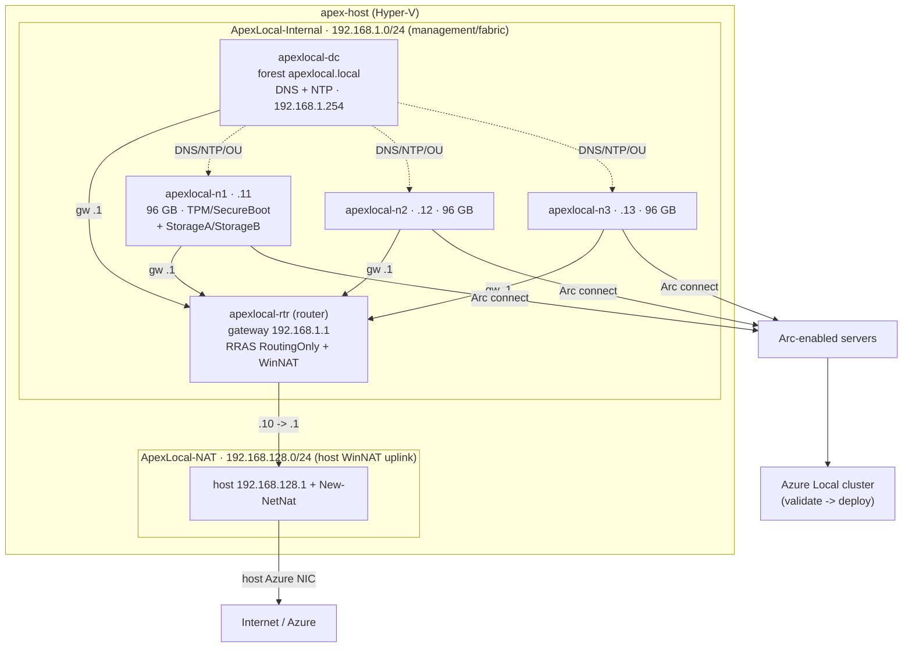

# Self-hosted Azure Local — architecture

This profile (`azlocal-selfhosted`) stands up a nested 3‑node Azure Local cluster
with a **clean‑room, zero‑Jumpstart** build: no prebaked Jumpstart VHDs, no
`Azure.Arc.Jumpstart.*` PowerShell modules, and no vendored Jumpstart scripts.
Both base images come from **ISOs the operator stages into a storage account**;
the cluster host converts them to bootable VHDXs and builds everything itself with
the in‑repo [`ApexLocalOps`](../artifacts/selfhosted/PowerShell/ApexLocalOps/ApexLocalOps.psm1) module.

## Azure topology

```mermaid
flowchart TB
    subgraph RG["Resource group (rg-apexlocal)"]
        subgraph VNet["VNet 172.16.0.0/16"]
            subgraph WL["Workload subnet 172.16.1.0/24 · NSG closed inbound · defaultOutbound off"]
                MGMT["apex-mgmt jumpbox<br/>WS2025 · D4s_v5<br/>MI · no public IP"]
                HOST["apex-host cluster host<br/>WS2025 · E64s_v6<br/>12x P30 -> V: · MI · no public IP"]
            end
            subgraph BAS["AzureBastionSubnet 172.16.3.64/26"]
                BASTION["Azure Bastion (Standard)"]
            end
        end
        NAT["NAT Gateway + static PIP<br/>(all egress)"]
        SA["Storage account (hardened)<br/>iso-images/ + logs/"]
        LA["Log Analytics workspace"]
    end
    OP["Operator"] -->|RDP over Bastion| BASTION --> MGMT
    MGMT -->|Upload-Isos.ps1 (MI)| SA
    HOST -->|pull ISOs + write logs (MI)| SA
    HOST -->|Azure Monitor Agent + DCR| LA
    WL -->|egress| NAT
    HOST -. progress tags / cluster .-> ARM["Azure Local instance<br/>(Arc-projected)"]
```

**RBAC (assigned in [main.bicep](../infra/bicep/azlocal-selfhosted/main.bicep)):**

| Principal | Role | Scope | Why |
|---|---|---|---|
| Deployer (you / CI) | Storage Blob Data **Owner** | storage account | upload the ISOs (control‑plane Owner ≠ data access) |
| `apex-host` identity | Storage Blob Data **Contributor** | storage account | read ISOs, write build logs |
| `apex-host` identity | **Tag Contributor** + **Reader** | resource group | progress tags + metadata |
| `apex-host` identity | **Contributor** + **User Access Administrator** | resource group | the in‑VM cluster deploy creates resources **and assigns roles** — UAA is required, not optional |
| `apex-mgmt` identity | Storage Blob Data **Contributor** | storage account | upload the ISOs from the jumpbox |

> The `apex-mgmt` **jumpbox** is the operator's in‑Azure workstation for the one
> manual step (download + upload the two ISOs). Separately, the nested **router VM**
> (built inside `apex-host`) is the management subnet's gateway — the Jumpstart model.

## Nested topology (inside `apex-host`)



The **router VM** (`apexlocal-rtr`) is the management subnet's default gateway
(`192.168.1.1`) — exactly as Jumpstart's `vm-router` is. It has a second NIC on the
`ApexLocal-NAT` switch and forwards/NATs nested egress to the host's WinNAT, which
in turn bridges onto the host's real Azure NIC. The DC is the authoritative DNS/NTP
source. Nodes carry extra `StorageA`/`StorageB` adapters for the Azure Local storage
intent.

## End-to-end build flow

```mermaid
sequenceDiagram
    autonumber
    participant Op as Operator
    participant Dep as deploy-selfhosted.sh
    participant ARM as Azure (ARM)
    participant Host as apex-host (CSE)
    participant SA as Storage (iso-images)
    participant Box as apex-mgmt jumpbox

    Op->>Dep: run (prompts password; resolves deployer + HCI RP oids)
    Dep->>ARM: deploy main.bicep (storage, network, Bastion, NAT, LA, 2 VMs, RBAC)
    ARM->>Host: CustomScriptExtension -> Bootstrap.ps1
    Host->>Host: pool disks -> V:, install Hyper-V, autologon, reboot
    Host->>Host: Phase 2 — internal + NAT switches, then WAIT for ISOs
    Op->>Box: RDP over Bastion, download both ISOs
    Box->>SA: Upload-Isos.ps1 (MI) -> AzureLocalOS.iso + WindowsServer.iso
    Host->>SA: detect + pull both ISOs (MI)
    Host->>Host: Convert-ApexIsoToVhdx x2 (bootable VHDX)
    Host->>Host: New-ApexRouterVM (gateway 192.168.1.1, RRAS + WinNAT)
    Host->>Host: New-ApexDomainController (forest + DNS + NTP)
    Host->>Host: New-ApexLocalNode x3 (static IPs, storage NICs, time sync)
    Host->>ARM: Connect-ApexNodeToArc (azcmagent) -> Arc machines
    Host->>ARM: Invoke-ApexLocalClusterDeploy (Validate -> Deploy)
    ARM-->>Op: cluster Succeeded / Connected (monitor-selfhosted.sh)
```

## Why no marketplace image for the nested base?

Azure platform (marketplace) images are specialized and are **not** usable to seed
a nested Hyper‑V VM. So all three nested base images — the router, the Windows
Server DC base, and the Azure Local node base — are built from **ISOs** via DISM
([`Convert-ApexIsoToVhdx`](../artifacts/selfhosted/PowerShell/ApexLocalOps/ApexLocalOps.psm1));
the router and DC share the one Windows Server base VHDX. The two *Azure* VMs
(cluster host + jumpbox) still boot from a normal WS2025 marketplace image, which is
fine for real Azure VMs.

## Owned build scope (clean-room consequences)

Because this is a clean‑room build, several areas Jumpstart provided as a black box
are implemented here from first principles and are the highest‑risk parts. They are
flagged inline in the module with `OWNED-SCOPE:` and summarized in
[the plan](plans/plan-selfHostedAzureLocal.prompt.md):

- **ISO → bootable VHDX** (`Convert-ApexIsoToVhdx`) — no prebaked VHD exists. A
  boot‑from‑ISO + `autounattend` fallback is built into `New-ApexNestedVM
  -BootFromIso` if offline imaging stalls on a given Azure Local build.
- **Arc bootstrap** (`Connect-ApexNodeToArc`) — node Arc onboarding + the
  deployment prerequisites the cloud deploy expects (more than `azcmagent connect`).
- **Fabric networking** (`New-ApexHostSwitch` + `New-ApexRouterVM` + node storage
  NICs) — two host switches (mgmt + NAT uplink), a router VM as the management
  gateway (Jumpstart's `vm-router` model), and intent‑based storage adapters.
- **Time sync** (`Set-ApexNodeTimeSync`) — Azure Local is acutely time‑sensitive;
  the DC is NTP‑authoritative and Hyper‑V time integration is disabled on guests.

See also: [selfhosted-quickstart.md](selfhosted-quickstart.md) ·
[selfhosted-sizing.md](selfhosted-sizing.md).
