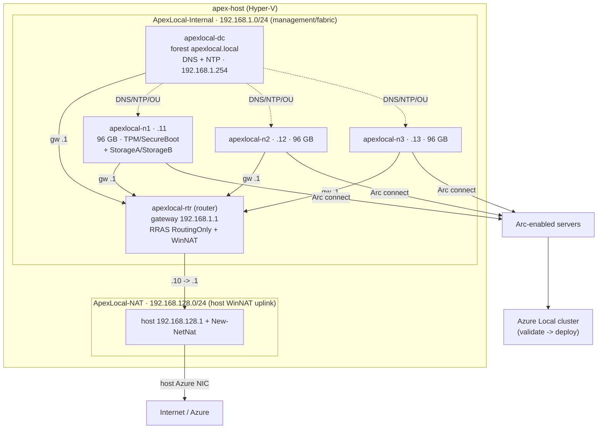

# Self-hosted overview

[Documentation home](../README.md) / Self-hosted / Overview

The self-hosted profile (`azlocal-selfhosted`) builds a nested 3-node Azure Local cluster with
a clean-room, zero-Jumpstart build: no prebaked Jumpstart VHDs, no `Azure.Arc.Jumpstart.*`
PowerShell modules, and no vendored Jumpstart scripts. Both base images come from ISOs that you
stage into a storage account; the cluster host converts them to bootable VHDXs and builds
everything itself with the in-repo
[`ApexLocalOps`](../../artifacts/selfhosted/PowerShell/ApexLocalOps/ApexLocalOps.psm1) module.

This page explains the topology, the role-based access control (RBAC) model, and the build
flow. To deploy, go to the [Self-hosted quickstart](quickstart.md).

## In this guide

- [When to use this profile](#when-to-use-this-profile)
- [Azure topology](#azure-topology)
- [Nested topology](#nested-topology)
- [End-to-end build flow](#end-to-end-build-flow)
- [Why no marketplace image for the nested base](#why-no-marketplace-image-for-the-nested-base)
- [Owned build scope](#owned-build-scope)

## When to use this profile

Choose self-hosted when you need a transparent build with no Arc Jumpstart dependency — for
example, in a sovereign, restricted, or audit-sensitive environment. If you want the fastest
path to a cluster and a Jumpstart-based build is acceptable, use the
[LocalBox profile](../localbox/overview.md) instead. For a lighter edge device, use the
[SFF profile](../sff/overview.md). For a full comparison, see
[Choose a profile](../choose-a-profile.md).

## Azure topology

```mermaid
flowchart TB
    subgraph RG["Resource group (rg-apexlocal)"]
        subgraph VNet["VNet 172.16.0.0/16"]
            subgraph WL["Workload subnet 172.16.1.0/24 · NSG closed inbound · defaultOutbound off"]
                MGMT["apex-mgmt jumpbox<br/>WS2025 · D4s_v5<br/>MI · no public IP"]
                HOST["apex-host cluster host<br/>WS2025 · E64s_v6<br/>12x P30 -> V: · MI · no public IP"]
            end
            subgraph BAS["AzureBastionSubnet 172.16.3.64/26"]
                BASTION["Azure Bastion (Standard)"]
            end
        end
        NAT["NAT Gateway + static PIP<br/>(all egress)"]
        SA["Storage account (hardened)<br/>iso-images/ + logs/"]
        LA["Log Analytics workspace"]
    end
    OP["Operator"] -->|RDP over Bastion| BASTION --> MGMT
    MGMT -->|Upload-Isos.ps1 (MI)| SA
    HOST -->|pull ISOs + write logs (MI)| SA
    HOST -->|Azure Monitor Agent + DCR| LA
    WL -->|egress| NAT
    HOST -. progress tags / cluster .-> ARM["Azure Local instance<br/>(Arc-projected)"]
```

**Diagram key:** solid arrows are network and data paths; the dotted arrow is the Arc
projection of the cluster into Azure. `MI` is a managed identity; the VMs have no public IP and
all egress goes through the NAT Gateway.

The RBAC assignments, made in
[main.bicep](../../infra/bicep/azlocal-selfhosted/main.bicep), are:

| Principal | Role | Scope | Why |
| --- | --- | --- | --- |
| Deployer (you / CI) | Storage Blob Data **Owner** | Storage account | Upload the ISOs (a control-plane Owner role is not data access). |
| `apex-host` identity | Storage Blob Data **Contributor** | Storage account | Read ISOs and write build logs. |
| `apex-host` identity | **Tag Contributor** + **Reader** | Resource group | Progress tags and metadata. |
| `apex-host` identity | **Contributor** + **User Access Administrator** | Resource group | The in-VM cluster deploy creates resources **and assigns roles** — UAA is required, not optional. |
| `apex-mgmt` identity | Storage Blob Data **Contributor** | Storage account | Upload the ISOs from the jumpbox. |

> [!NOTE]
> The `apex-mgmt` jumpbox is the operator's in-Azure workstation for the one manual step
> (download and upload the two ISOs). Separately, the nested router VM — built inside
> `apex-host` — is the management subnet's gateway, mirroring the Jumpstart model.

## Nested topology



**Diagram key:** the two `subgraph` boxes are the host's internal and NAT-uplink Hyper-V
switches. Solid arrows are routed traffic; the dotted arrow is the DNS, NTP, and organizational
unit (OU) configuration the domain controller applies to the nodes.

The router VM (`apexlocal-rtr`) is the management subnet's default gateway (`192.168.1.1`),
exactly as Jumpstart's `vm-router` is. It has a second network interface on the
`ApexLocal-NAT` switch and forwards and NATs nested egress to the host's WinNAT, which in turn
bridges onto the host's real Azure network interface. The domain controller is the
authoritative DNS and NTP source. The nodes carry extra `StorageA` and `StorageB` adapters for
the Azure Local storage intent.

## End-to-end build flow

```mermaid
sequenceDiagram
    autonumber
    participant Op as Operator
    participant Dep as deploy-selfhosted.sh
    participant ARM as Azure (ARM)
    participant Host as apex-host (CSE)
    participant SA as Storage (iso-images)
    participant Box as apex-mgmt jumpbox

    Op->>Dep: run (prompts password; resolves deployer + HCI RP oids)
    Dep->>ARM: deploy main.bicep (storage, network, Bastion, NAT, LA, 2 VMs, RBAC)
    ARM->>Host: CustomScriptExtension -> Bootstrap.ps1
    Host->>Host: pool disks -> V:, install Hyper-V, autologon, reboot
    Host->>Host: Phase 2 — internal + NAT switches, then WAIT for ISOs
    Op->>Box: RDP over Bastion, download both ISOs
    Box->>SA: Upload-Isos.ps1 (MI) -> AzureLocalOS.iso + WindowsServer.iso
    Host->>SA: detect + pull both ISOs (MI)
    Host->>Host: Convert-ApexIsoToVhdx x2 (bootable VHDX)
    Host->>Host: New-ApexRouterVM (gateway 192.168.1.1, RRAS + WinNAT)
    Host->>Host: New-ApexDomainController (forest + DNS + NTP)
    Host->>Host: New-ApexLocalNode x3 (static IPs, storage NICs, time sync)
    Host->>ARM: Connect-ApexNodeToArc (azcmagent) -> Arc machines
    Host->>ARM: Invoke-ApexLocalClusterDeploy (Validate -> Deploy)
    ARM-->>Op: cluster Succeeded / Connected (monitor-selfhosted.sh)
```

**Diagram key:** this sequence runs top to bottom. The only operator action after starting the
deploy is downloading and uploading the two ISOs (the `Op → Box` and `Box → SA` steps);
everything else is automated.

## Why no marketplace image for the nested base

Azure platform (marketplace) images are specialized and **cannot** seed a nested Hyper-V VM. So
all three nested base images — the router, the Windows Server domain controller base, and the
Azure Local node base — are built from ISOs through DISM
([`Convert-ApexIsoToVhdx`](../../artifacts/selfhosted/PowerShell/ApexLocalOps/ApexLocalOps.psm1));
the router and domain controller share the one Windows Server base VHDX. The two Azure VMs (the
cluster host and the jumpbox) still boot from a normal Windows Server 2025 marketplace image,
which is fine for real Azure VMs.

## Owned build scope

Because this is a clean-room build, several areas that Jumpstart provided as a black box are
implemented here from first principles and are the highest-risk parts. They are flagged inline
in the module with `OWNED-SCOPE:` and summarized in
[the plan](../plans/plan-selfHostedAzureLocal.prompt.md):

- **ISO to bootable VHDX** (`Convert-ApexIsoToVhdx`) — no prebaked VHD exists. A boot-from-ISO
  plus `autounattend` fallback is built into `New-ApexNestedVM -BootFromIso` if offline imaging
  stalls on a given Azure Local build.
- **Arc bootstrap** (`Connect-ApexNodeToArc`) — node Arc onboarding plus the deployment
  prerequisites the cloud deploy expects (more than `azcmagent connect`).
- **Fabric networking** (`New-ApexHostSwitch` + `New-ApexRouterVM` + node storage NICs) — two
  host switches (management and NAT uplink), a router VM as the management gateway (Jumpstart's
  `vm-router` model), and intent-based storage adapters.
- **Time sync** (`Set-ApexNodeTimeSync`) — Azure Local is acutely time-sensitive; the domain
  controller is NTP-authoritative and Hyper-V time integration is disabled on guests.

## Next steps

- Plan capacity and cost: [Self-hosted sizing and cost](sizing.md).
- Deploy the cluster: [Self-hosted quickstart](quickstart.md).

---

[Documentation home](../README.md) · [Choose a profile](../choose-a-profile.md) · [Glossary](../glossary.md)
