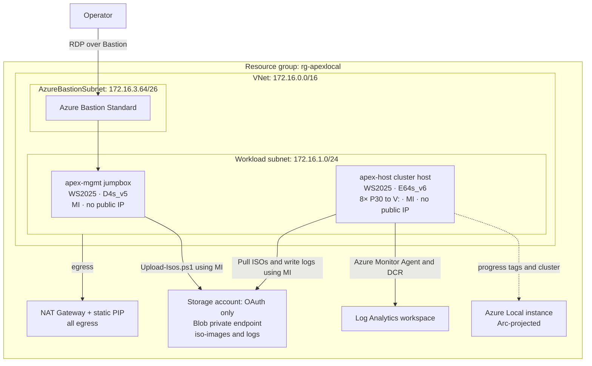
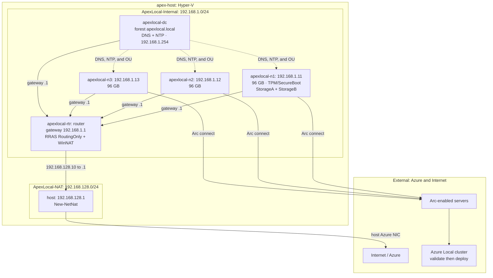

# Self-hosted overview

[Documentation home](../README.md) / Self-hosted / Overview

The self-hosted profile (`azlocal-selfhosted`) builds a nested 3-node Azure Local cluster with
a clean-room, zero-Jumpstart build: no prebaked Jumpstart VHDs, no `Azure.Arc.Jumpstart.*`
PowerShell modules, and no vendored Jumpstart scripts. Both base images come from ISOs that you
stage into a storage account; the cluster host converts them to bootable VHDXs and builds
everything itself with the in-repo
[`ApexLocalOps`](../../artifacts/selfhosted/PowerShell/ApexLocalOps/ApexLocalOps.psm1) module.

This page explains the topology, the role-based access control (RBAC) model, and the build
flow. To deploy, go to the [Self-hosted quickstart](quickstart.md).

## In this guide

- [When to use this profile](#when-to-use-this-profile)
- [Azure topology](#azure-topology)
- [Nested topology](#nested-topology)
- [End-to-end build flow](#end-to-end-build-flow)
- [Why no marketplace image for the nested base](#why-no-marketplace-image-for-the-nested-base)
- [Owned build scope](#owned-build-scope)

## When to use this profile

Choose self-hosted when you need a transparent build with no Arc Jumpstart dependency — for
example, in a sovereign, restricted, or audit-sensitive environment. For a lighter edge device,
use the [SFF profile](../sff/overview.md). For a full comparison, see
[Choose a profile](../choose-a-profile.md).

## Azure topology

```mermaid
flowchart TB
    subgraph RG["Resource group: rg-apexlocal"]
        subgraph VNET["VNet: 172.16.0.0/16"]
            subgraph WORKLOAD["Workload subnet: 172.16.1.0/24"]
                MGMT["apex-mgmt jumpbox<br>WS2025 · D4s_v5<br>MI · no public IP"]
                HOST["apex-host cluster host<br>WS2025 · E64s_v6<br>8× P30 to V: · MI · no public IP"]
            end
            subgraph BASTION_SUBNET["AzureBastionSubnet: 172.16.3.64/26"]
                BASTION["Azure Bastion Standard"]
            end
        end
        NAT["NAT Gateway + static PIP<br>all egress"]
        STORAGE["Storage account: OAuth only<br>Blob private endpoint<br>iso-images and logs"]
        LOGS["Log Analytics workspace"]
        LOCAL["Azure Local instance<br>Arc-projected"]
    end

    OPERATOR["Operator"] -->|"RDP over Bastion"| BASTION
    BASTION --> MGMT
    MGMT -->|"Upload-Isos.ps1 using MI"| STORAGE
    HOST -->|"Pull ISOs and write logs using MI"| STORAGE
    HOST -->|"Azure Monitor Agent and DCR"| LOGS
    WORKLOAD -->|"egress"| NAT
    HOST -.->|"progress tags and cluster"| LOCAL
```

**Diagram key:** solid arrows are network and data paths; the dotted arrow is the Arc
projection of the cluster into Azure. `MI` is a managed identity; the VMs have no public IP and
all egress goes through the NAT Gateway.

The RBAC assignments, made in
[main.bicep](../../infra/bicep/azlocal-selfhosted/main.bicep), are:

| Principal | Role | Scope | Why |
| --- | --- | --- | --- |
| `apex-host` identity | Storage Blob Data **Contributor** | Storage account | Read ISOs and write build logs. |
| `apex-host` identity | **Contributor** + **User Access Administrator** | Resource group | The in-VM cluster deploy creates resources **and assigns roles** — UAA is required, not optional. |
| `apex-mgmt` identity | Storage Blob Data **Contributor** | Storage account | Upload the ISOs from the jumpbox. |

> [!NOTE]
> The `apex-mgmt` jumpbox is the operator's in-Azure workstation for the one manual step
> (download and upload the two ISOs). Separately, the nested router VM — built inside
> `apex-host` — is the management subnet's gateway, mirroring the Jumpstart model.

## Nested topology

```mermaid
flowchart TB
    subgraph HOST["apex-host: Hyper-V"]
        subgraph INTERNAL["ApexLocal-Internal: 192.168.1.0/24"]
            ROUTER["apexlocal-rtr: router<br>gateway 192.168.1.1<br>RRAS RoutingOnly + WinNAT"]
            DC["apexlocal-dc<br>forest apexlocal.local<br>DNS + NTP · 192.168.1.254"]
            NODE1["apexlocal-n1: 192.168.1.11<br>96 GB · TPM/SecureBoot<br>StorageA + StorageB"]
            NODE2["apexlocal-n2: 192.168.1.12<br>96 GB"]
            NODE3["apexlocal-n3: 192.168.1.13<br>96 GB"]
        end
        subgraph NAT_NETWORK["ApexLocal-NAT: 192.168.128.0/24"]
            HOST_NAT["host: 192.168.128.1<br>New-NetNat"]
        end
    end
    subgraph EXTERNAL["External: Azure and Internet"]
        INTERNET["Internet / Azure"]
        ARC["Arc-enabled servers"]
        CLUSTER["Azure Local cluster<br>validate then deploy"]
    end

    NODE1 -->|"gateway .1"| ROUTER
    NODE2 -->|"gateway .1"| ROUTER
    NODE3 -->|"gateway .1"| ROUTER
    DC -->|"gateway .1"| ROUTER
    ROUTER -->|"192.168.128.10 to .1"| HOST_NAT
    HOST_NAT -->|"host Azure NIC"| INTERNET
    NODE1 -->|"Arc connect"| ARC
    NODE2 -->|"Arc connect"| ARC
    NODE3 -->|"Arc connect"| ARC
    ARC --> CLUSTER
    DC -.->|"DNS, NTP, and OU"| NODE1
    DC -.->|"DNS, NTP, and OU"| NODE2
    DC -.->|"DNS, NTP, and OU"| NODE3
```

**Diagram key:** the nested host (left) contains two Hyper-V virtual switches: the internal
management/fabric switch and the NAT-uplink switch. Solid arrows show routed traffic; dotted
arrows show DNS, NTP, and organizational unit (OU) configuration. The external group (right)
shows the Arc projection and cluster deployment context.

The router VM (`apexlocal-rtr`) is the management subnet's default gateway (`192.168.1.1`),
exactly as Jumpstart's `vm-router` is. It has a second network interface on the
`ApexLocal-NAT` switch and forwards and NATs nested egress to the host's WinNAT, which in turn
bridges onto the host's real Azure network interface. The domain controller is the
authoritative DNS and NTP source. The nodes carry extra `StorageA` and `StorageB` adapters for
the Azure Local storage intent.

## End-to-end build flow

```mermaid
sequenceDiagram
    autonumber
    participant Operator
    participant Deploy as deploy-selfhosted.sh
    participant Azure as Azure ARM
    participant Host as apex-host CSE
    participant Storage as Storage iso-images
    participant Jumpbox as apex-mgmt jumpbox

    Operator->>Deploy: Run with approved password environment and immutable artifact SHA
    Deploy->>Azure: Deploy main.bicep: storage, network, Bastion, NAT, LA, VMs, RBAC
    Azure->>Host: CustomScriptExtension runs Bootstrap.ps1
    Host->>Host: Pool disks to V:, install Hyper-V, autologon, reboot
    Host->>Host: Create internal and NAT switches, then wait for ISOs
    Operator->>Jumpbox: RDP over Bastion and download both ISOs
    Jumpbox->>Storage: Upload-Isos.ps1 uploads ISOs and SHA-256 manifest using MI
    Host->>Storage: Validate manifest, pull, and hash both ISOs using MI
    Host->>Host: Convert-ApexIsoToVhdx twice to create bootable VHDXs
    Host->>Host: Create router VM with gateway 192.168.1.1, RRAS, and WinNAT
    Host->>Host: Create domain controller with forest, DNS, and NTP
    Host->>Host: Create three nodes with static IPs, storage NICs, and time sync
    Host->>Azure: Invoke-AzStackHciArcInitialization creates Arc machines
    Host->>Azure: Start-ApexLocalClusterDeployment validates and deploys
    Azure-->>Operator: Cluster succeeds and connects; monitor-selfhosted.sh reports status
```

**Diagram key:** this sequence runs top to bottom. The only operator action after starting the
deploy is downloading and uploading the two ISOs (the `Op → Box` and `Box → SA` steps);
everything else is automated.

## Why no marketplace image for the nested base

Azure platform (marketplace) images are specialized and **cannot** seed a nested Hyper-V VM. So
all three nested base images — the router, the Windows Server domain controller base, and the
Azure Local node base — are built from ISOs through DISM
([`Convert-ApexIsoToVhdx`](../../artifacts/selfhosted/PowerShell/ApexLocalOps/ApexLocalOps.psm1));
the router and domain controller share the one Windows Server base VHDX. The two Azure VMs (the
cluster host and the jumpbox) still boot from a normal Windows Server 2025 marketplace image,
which is fine for real Azure VMs.

## Owned build scope

Because this is a clean-room build, several areas that Jumpstart provided as a black box are
implemented here from first principles and are the highest-risk parts. They are flagged inline
in the module with `OWNED-SCOPE:` and summarized in
[the plan](../plans/plan-selfHostedAzureLocal.prompt.md):

- **ISO to bootable VHDX** (`Convert-ApexIsoToVhdx`) — no prebaked VHD exists. Conversion uses
    explicit image selection, temporary VHDX paths, UEFI boot validation, and atomic promotion.
- **Arc bootstrap** (`Connect-ApexNodeToArc`) — uses the Azure Local OS-bundled
    `Invoke-AzStackHciArcInitialization` command with a transient host managed-identity token.
- **Fabric networking** (`New-ApexHostSwitch` + `New-ApexRouterVM` + node storage NICs) — two
  host switches (management and NAT uplink), a router VM as the management gateway (Jumpstart's
  `vm-router` model), and intent-based storage adapters.
- **Time sync** (`Set-ApexNodeTimeSync`) — Azure Local is acutely time-sensitive; the domain
  controller is NTP-authoritative and Hyper-V time integration is disabled on guests.

## Next steps

- Plan capacity and cost: [Self-hosted sizing and cost](sizing.md).
- Deploy the cluster: [Self-hosted quickstart](quickstart.md).
- Review the release gate and evidence schema: [Self-hosted validation](validation.md).

---

[Documentation home](../README.md) · [Choose a profile](../choose-a-profile.md) · [Glossary](../glossary.md)
