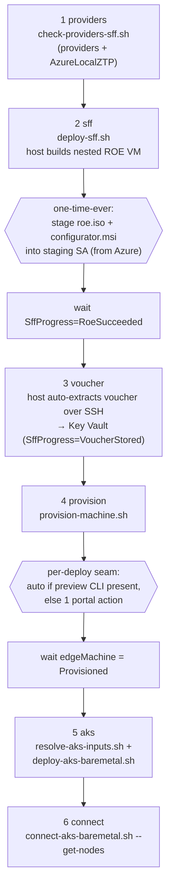

# Zero-touch end-to-end deployment

This is the most hands-off path from nothing to a running AKS-on-bare-metal cluster on a
nested Azure Local **Small Form Factor (SFF)** machine. One orchestrator
([scripts/deploy-all.sh](../scripts/deploy-all.sh)) chains every stage with tag- and
resource-gated waits, so you start it once and it drives itself between the two irreducible
human touchpoints.

> [!IMPORTANT]
> SFF-on-VM and AKS on bare metal are **previews** for evaluation. The single per-deploy
> manual step below exists only because the SFF machine-provisioning CLI is preview-gated; if
> that CLI becomes available in your environment, the chain becomes fully unattended.

## One command

```bash
az login
./scripts/deploy-all.sh
```

That runs: **providers → SFF host build → (auto) ownership voucher → Azure machine
provisioning → AKS on bare metal → `kubectl get nodes`.** The Entra admin group for cluster
access is **created automatically** (and reused if a group of the same name already exists).
Customize or override it:

```bash
./scripts/deploy-all.sh --admin-group-name "My AKS Admins"   # auto-create/reuse this name
./scripts/deploy-all.sh --admin-group <existing-group-guid>   # use a specific existing group
```

## The pipeline



## What got automated (and how)

| Stage | Before | Now | Mechanism |
| --- | --- | --- | --- |
| Providers + ZTP feature | scripted | ✅ auto | [check-providers-sff.sh](../scripts/check-providers-sff.sh) |
| **Entra admin group** | manual | ✅ **auto** | [ensure-admin-group.sh](../scripts/ensure-admin-group.sh) creates it (or reuses a same-named group) and adds you as a member |
| ROE ISO acquisition | manual each time | ✅ **once ever** | cached in the staging SA, reused every deploy |
| Host → nested ROE VM | auto | ✅ auto | autologon + scheduled-task watcher |
| **Voucher extraction** | **GUI Configurator** | ✅ **auto** | host SSHes the nested VM and pulls the `.pem` → Key Vault ([Get-OwnershipVoucher-Ssh.ps1](../artifacts/sff/PowerShell/Get-OwnershipVoucher-Ssh.ps1)) |
| Site + machine + install-os | portal | ⚙️ auto-or-guided | [provision-machine.sh](../scripts/provision-machine.sh) detects the preview CLI; else 1 portal action + auto-wait |
| AKS inputs (custom location, CP IP) | manual | ✅ auto | [resolve-aks-inputs.sh](../scripts/resolve-aks-inputs.sh) |
| AKS deploy + connect | scripted | ✅ auto | [deploy-aks-baremetal.sh](../scripts/deploy-aks-baremetal.sh) + [connect-aks-baremetal.sh](../scripts/connect-aks-baremetal.sh) |

## The two irreducible touchpoints (honest)

1. **One-time-ever — stage the ROE ISO + Configurator App.** These are Microsoft-owned,
   portal/subscription-gated artifacts with no public download API, so they can't be vendored
   or fetched headlessly. You download them once from the Azure portal **from an Azure resource**
   (the Bastion jumpbox or Cloud Shell) and upload them to the staging storage account
   ([Publish-SffArtifacts.ps1](../artifacts/sff/PowerShell/Publish-SffArtifacts.ps1)). They are
   then cached and reused for every future deploy — **not** per-run.

2. **Per-deploy — the machine-provisioning step (only if the preview CLI is absent).** Creating
   the Arc site and registering the machine from its ownership voucher is gated behind the SFF
   preview. The `az provisionedmachine` command group is **not** in the public Azure CLI today
   (verified: not in CLI 2.87.0, not in the public extension index), and the underlying
   `Microsoft.AzureStackHCI/edgeMachines` API is undocumented/preview-volatile, so the chain does
   **not** hand-roll it. Instead, [provision-machine.sh](../scripts/provision-machine.sh):
   - **pre-creates the Arc site** (create-or-reuse) via
     [ensure-arc-site.sh](../scripts/ensure-arc-site.sh) (`az site`), so it is simply
     **selectable** in the wizard rather than created by hand (the Arc Gateway is optional);
   - **auto** — if it detects a usable provisioning CLI verb, it creates the site, registers the
     machine from the Key Vault voucher, and runs `install-os AzureLinux`; then
   - **guided** — otherwise it prints the exact one-screen portal action and **polls the edge
     machine until it reaches `Provisioned`**, so the rest of the chain (AKS) proceeds
     automatically the moment you finish.

Everything else — provider registration, the multi-hour host build, voucher extraction, the
install-os wait, AKS input gathering, the AKS deployment, and the `kubectl` connection — runs
unattended.

## Resuming and partial runs

The orchestrator is stage-addressable, so you can resume after the one-time ISO stage or rerun a
single stage:

```bash
# Resume from the voucher stage onward (e.g. after the host finished building):
./scripts/deploy-all.sh --from voucher

# Just (re)deploy AKS once the machine is Provisioned:
./scripts/deploy-all.sh --from aks

# Preview the plan without running anything:
./scripts/deploy-all.sh --admin-group <guid> --dry-run

# Skip stages you've already done:
./scripts/deploy-all.sh --skip providers,sff --admin-group <guid>
```

Stages: `providers → sff → voucher → provision → aks → connect` (addressable by name or number).

## Prerequisites

- `az login`, with Owner (or Contributor + RBAC Admin) on the subscription.
- A Windows admin password — `deploy-sff.sh` prompts (or set `LOCALSFF_ADMIN_PASSWORD`).
- Directory permission to create an Entra security group **or** an existing group passed via
  `--admin-group <object-id>` (the chain auto-creates/reuses `LocalSFF-AKS-Admins` otherwise).
- An SSH public key at `~/.ssh/id_rsa.pub` (or pass `--ssh-key-file`).

## Per-stage scripts (if you prefer manual control)

| Stage | Script |
| --- | --- |
| Providers + ZTP | [check-providers-sff.sh](../scripts/check-providers-sff.sh) |
| SFF host build + monitor | [deploy-sff.sh](../scripts/deploy-sff.sh), [monitor-sff.sh](../scripts/monitor-sff.sh) |
| Voucher (manual fallback) | [sff-runbook.md](sff-runbook.md) §1–2 |
| Arc site | [ensure-arc-site.sh](../scripts/ensure-arc-site.sh) |
| Machine provisioning | [provision-machine.sh](../scripts/provision-machine.sh) |
| AKS inputs + deploy | [resolve-aks-inputs.sh](../scripts/resolve-aks-inputs.sh), [deploy-aks-baremetal.sh](../scripts/deploy-aks-baremetal.sh) |
| Connect | [connect-aks-baremetal.sh](../scripts/connect-aks-baremetal.sh) |
| Sample app | [deploy-aks-sample-app.sh](../scripts/deploy-aks-sample-app.sh) |

## Clean up

```bash
./scripts/cleanup-sff.sh                 # SFF host + nested VM + staging + Key Vault
# The AKS cluster (if deployed) lives in the SAME resource group; remove its resources
# individually rather than deleting the group:
az resource delete -g rg-azlocal-sff-eus01 -n localsff-aks --resource-type Microsoft.Kubernetes/connectedClusters 2>/dev/null || true
```
