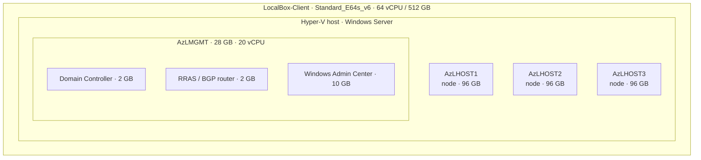

# Sizing Guidance — Azure VM, Disks & Nested Azure Local

How LocalBox is sized and what it costs. All values are verified against the vendored
`artifacts/PowerShell/LocalBox-Config.psd1`; pricing is retail pay-as-you-go (USD,
Sweden Central) and approximate.

## TL;DR

Two selectable profiles (`clusterNodeCount` in `infra/bicep/azlocal-js/main.bicepparam`):

| Profile | Nodes | Host SKU | Data disks | Witness | RAM committed |
| ------- | ----- | -------- | ---------- | ------- | ------------- |
| **3-node (default)** | 3 × 96 GB | `Standard_E64s_v6` (512 GB) | 12 × 256 GB = 3 TB | none (odd quorum) | ~316 GB |
| **2-node** | 2 × 96 GB | `Standard_E32s_v6` (256 GB) | 8 × 256 GB = 2 TB | cloud witness | ~220 GB |

The table below details the **default 3-node profile**:

| Layer    | What you size     | Value                                     | Why                                  |
| -------- | ----------------- | ----------------------------------------- | ------------------------------------ |
| Azure VM | SKU               | `Standard_E64s_v6` (64 vCPU / 512 GB)     | Must fit ~316 GB of nested VM RAM.   |
| Azure VM | OS disk           | 1024 GB Premium SSD (P30)                 | Windows Server + VHDX image cache.   |
| Azure VM | Data disks        | 12 × 256 GB Premium SSD (P30 tier) = 3 TB | Pooled into `V:` for all nested VMs. |
| Nested   | Azure Local nodes | `AzLHOST1`/`AzLHOST2`/`AzLHOST3` @ 96 GB   | The 3-node cluster (no witness).     |
| Nested   | Management host   | `AzLMGMT` @ 28 GB / 20 vCPU               | Hosts DC + router + WAC.             |
| Nested   | S2D storage       | 3 nodes × 4 × 170 GB dynamic VHDX         | Software-defined storage pool.       |

**On the default profile you cannot shrink the VM below E64 (512 GB RAM).** The 3-node
workload commits ~316 GB; E32 (256 GB) cannot boot all three nodes. To use E32, switch to
the **2-node profile** (`clusterNodeCount = 2`, which also enables a cloud witness).

> **Why 3 nodes by default?** An odd number of nodes gives the cluster odd quorum, so it
> needs **no witness** at all. That removes the cloud-witness storage account entirely —
> which is what an `allowSharedKeyAccess = false` storage policy would otherwise block (the
> cloud witness requires shared-key auth). A 2-node cluster *must* have a witness; a 3-node
> cluster must not. Choose 2-node only where shared-key storage is permitted.

## Host VM

LocalBox runs **everything inside one Azure VM** (`LocalBox-Client`), a Windows Server
Hyper-V host. The template allows these SKUs:

| SKU                | vCPU | RAM    | Notes                                            |
| ------------------ | ---- | ------ | ------------------------------------------------ |
| `Standard_E32s_v5` | 32   | 256 GB | 2-node only — too small for the 3-node default.  |
| `Standard_E32s_v6` | 32   | 256 GB | 2-node only — too small for the 3-node default.  |
| `Standard_E64s_v6` | 64   | 512 GB | **Default**; required for the 3-node cluster.    |

**RAM is the binding constraint.** The four top-level nested VMs commit
`96 + 96 + 96 + 28 = 316 GB`, leaving ~196 GB for the host OS and Hyper-V — comfortable
headroom on E64. E32 (256 GB) cannot hold three 96 GB nodes plus the 28 GB management host,
so the default is `E64s_v6`. (If you drop back to a 2-node cluster you can use `E32s_v6`,
but then a witness is mandatory.)

## Disks

One OS disk + twelve data disks, all Premium SSD (LRS):

| Disk      | Size        | Tier                         | Caching   | Purpose                                         |
| --------- | ----------- | ---------------------------- | --------- | ----------------------------------------------- |
| OS (`C:`) | 1024 GB     | P30                          | ReadWrite | Windows Server, tooling, VHDX image cache.      |
| Data 0–11 | 256 GB each | **P30 (perf-tier override)** | None      | Striped into the `V:` pool for nested VM VHDXs. |

> **P30 on a 256 GB disk is a performance-tier override.** A 256 GB Premium SSD bills at
> the **P15** baseline (1,100 IOPS / 125 MB/s). Setting each disk's performance `tier` to
> `P30` keeps the 256 GB capacity but delivers 5,000 IOPS / 200 MB/s — at the full P30
rate (~$148.68/disk/mo). This is encoded in `infra/bicep/azlocal-js/host/host.bicep`. To revert to the
> P15 baseline, clear `dataDiskPerformanceTier` there.

The twelve disks form a ~3 TB Storage Spaces pool (`V:`) where the nested VMs live. Each
Azure Local node presents 4 dynamic VHDX disks of 170 GB (`3 × 4 × 170 = 2,040 GB` of S2D
capacity) plus node OS VHDXs and the management VMs. The disk count was raised from 8 to 12
to give the third node's S2D footprint headroom. **Do not reduce disk count or size** —
the S2D pool and image cache assume this layout.

## Nested Azure Local (inside the VM)

| Nested VM                          | RAM             | Role                                            |
| ---------------------------------- | --------------- | ----------------------------------------------- |
| `AzLHOST1` / `AzLHOST2` / `AzLHOST3` | 96 GB each    | Azure Local cluster nodes (3 → no witness)      |
| `AzLMGMT`                          | 28 GB / 20 vCPU | Nested Hyper-V host for management VMs          |
| → DC / router / WAC                | 2 / 2 / 10 GB   | Run **inside** `AzLMGMT`'s 28 GB (not additive) |

## Regions

LocalBox uses **two** region parameters; Sweden Central is valid for only one:

| Parameter                                       | Set to          | Notes                                                              |
| ----------------------------------------------- | --------------- | ------------------------------------------------------------------ |
| `location` (VM, disks, VNet, …)                 | `swedencentral` | Your infra region; needs Esv6 quota (64 vCPU).                     |
| `azureLocalInstanceLocation` (Arc registration) | `westeurope`    | **`swedencentral` is not supported** for the Azure Local instance. |

Supported `azureLocalInstanceLocation` values: `australiaeast`, `southcentralus`, `eastus`,
`westeurope`, `southeastasia`, `canadacentral`, `japaneast`, `centralindia`. Deploying
infra in `swedencentral` while registering the instance in `westeurope` is normal and
supported.

## Cost (Sweden Central, USD, 730 hrs/mo)

### All-in, 24×7 (default config)

| Item                                       | Monthly              |
| ------------------------------------------ | -------------------- |
| VM `E64s_v6` (Windows)                     | ~$5,436              |
| OS disk P30 (1024 GB)                      | ~$149                |
| 12 × data disk P30 (256 GB, tier override) | ~$1,784              |
| Bastion (Basic) + NAT Gateway + public IPs | ~$179                |
| Windows 11 jumpbox `D4s_v5` + OS disk      | ~$303                |
| **Total**                                  | **≈ $7,850 / month** |

### Cost-control scenarios (client VM + P30 disks only)

| Usage pattern            | Monthly  |
| ------------------------ | -------- |
| 24/7 always on           | ≈ $7,370 |
| 8 hrs/day × 22 workdays  | ≈ $3,240 |
| Spot pricing, 24/7       | ≈ $2,940 |
| Deallocated (disks only) | ≈ $1,933 |

> **Disks, Bastion, and NAT bill even when the VMs are deallocated.** Stopping the VM saves
> compute only; delete the resource group to stop everything. The P30 tier override adds
> ~$1,282/mo over the P15 baseline (12 disks) — drop it if your lab doesn't need 5,000
> IOPS/disk. Switching back to a 2-node `E32s_v6` cluster roughly halves the compute cost
> but reintroduces the witness requirement.
