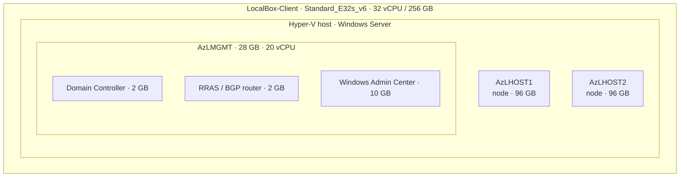

# Sizing Guidance — Azure VM, Disks & Nested Azure Local

How LocalBox is sized and what it costs. All values are verified against the vendored
`artifacts/PowerShell/LocalBox-Config.psd1`; pricing is retail pay-as-you-go (USD,
Sweden Central) and approximate.

## TL;DR

| Layer    | What you size     | Value                                    | Why                                  |
| -------- | ----------------- | ---------------------------------------- | ------------------------------------ |
| Azure VM | SKU               | `Standard_E32s_v6` (32 vCPU / 256 GB)    | Must fit ~220 GB of nested VM RAM.   |
| Azure VM | OS disk           | 1024 GB Premium SSD (P30)                | Windows Server + VHDX image cache.   |
| Azure VM | Data disks        | 8 × 256 GB Premium SSD (P30 tier) = 2 TB | Pooled into `V:` for all nested VMs. |
| Nested   | Azure Local nodes | `AzLHOST1` + `AzLHOST2` @ 96 GB each     | The 2-node cluster.                  |
| Nested   | Management host   | `AzLMGMT` @ 28 GB / 20 vCPU              | Hosts DC + router + WAC.             |
| Nested   | S2D storage       | 2 nodes × 4 × 170 GB dynamic VHDX        | Software-defined storage pool.       |

**You cannot shrink the VM below E32 (256 GB RAM).** The nested workload commits ~220 GB;
anything smaller (e.g. E16 at 128 GB) will not boot the cluster.

## Host VM

LocalBox runs **everything inside one Azure VM** (`LocalBox-Client`), a Windows Server
Hyper-V host. The template allows exactly two SKUs:

| SKU                | vCPU | RAM    | Notes                                      |
| ------------------ | ---- | ------ | ------------------------------------------ |
| `Standard_E32s_v5` | 32   | 256 GB | Proven, widely available.                  |
| `Standard_E32s_v6` | 32   | 256 GB | **Default**; newer silicon, similar price. |

**RAM is the binding constraint.** The three top-level nested VMs commit
`96 + 96 + 28 = 220 GB`, leaving ~36 GB for the host OS and Hyper-V — a deliberate, tight
fit. Pick `_v6` where you have quota; fall back to `_v5` if v6 capacity is constrained.

## Disks

One OS disk + eight data disks, all Premium SSD (LRS):

| Disk      | Size        | Tier                         | Caching   | Purpose                                         |
| --------- | ----------- | ---------------------------- | --------- | ----------------------------------------------- |
| OS (`C:`) | 1024 GB     | P30                          | ReadWrite | Windows Server, tooling, VHDX image cache.      |
| Data 0–7  | 256 GB each | **P30 (perf-tier override)** | None      | Striped into the `V:` pool for nested VM VHDXs. |

> **P30 on a 256 GB disk is a performance-tier override.** A 256 GB Premium SSD bills at
> the **P15** baseline (1,100 IOPS / 125 MB/s). Setting each disk's performance `tier` to
> `P30` keeps the 256 GB capacity but delivers 5,000 IOPS / 200 MB/s — at the full P30
> rate (~$148.68/disk/mo). This is encoded in `bicep/host/host.bicep`. To revert to the
> P15 baseline, clear `dataDiskPerformanceTier` there.

The eight disks form a ~2 TB Storage Spaces pool (`V:`) where the nested VMs live. Each
Azure Local node presents 4 dynamic VHDX disks of 170 GB (`2 × 4 × 170 = 1,360 GB` of S2D
capacity) plus node OS VHDXs and the management VMs. **Do not reduce disk count or size** —
the S2D pool and image cache assume this layout.

## Nested Azure Local (inside the VM)

| Nested VM               | RAM             | Role                                            |
| ----------------------- | --------------- | ----------------------------------------------- |
| `AzLHOST1` / `AzLHOST2` | 96 GB each      | Azure Local cluster nodes                       |
| `AzLMGMT`               | 28 GB / 20 vCPU | Nested Hyper-V host for management VMs          |
| → DC / router / WAC     | 2 / 2 / 10 GB   | Run **inside** `AzLMGMT`'s 28 GB (not additive) |

## Regions

LocalBox uses **two** region parameters; Sweden Central is valid for only one:

| Parameter                                       | Set to          | Notes                                                              |
| ----------------------------------------------- | --------------- | ------------------------------------------------------------------ |
| `location` (VM, disks, VNet, …)                 | `swedencentral` | Your infra region; needs Esv6/Esv5 quota.                          |
| `azureLocalInstanceLocation` (Arc registration) | `westeurope`    | **`swedencentral` is not supported** for the Azure Local instance. |

Supported `azureLocalInstanceLocation` values: `australiaeast`, `southcentralus`, `eastus`,
`westeurope`, `southeastasia`, `canadacentral`, `japaneast`, `centralindia`. Deploying
infra in `swedencentral` while registering the instance in `westeurope` is normal and
supported.

## Cost (Sweden Central, USD, 730 hrs/mo)

### All-in, 24×7 (default config)

| Item                                       | Monthly              |
| ------------------------------------------ | -------------------- |
| VM `E32s_v6` (Windows)                     | ~$2,718              |
| OS disk P30 (1024 GB)                      | ~$149                |
| 8 × data disk P30 (256 GB, tier override)  | ~$1,189              |
| Bastion (Basic) + NAT Gateway + public IPs | ~$179                |
| Windows 11 jumpbox `D4s_v5` + OS disk      | ~$303                |
| **Total**                                  | **≈ $4,540 / month** |

### Cost-control scenarios (client VM + P30 disks only)

| Usage pattern            | Monthly  |
| ------------------------ | -------- |
| 24/7 always on           | ≈ $4,060 |
| 8 hrs/day × 22 workdays  | ≈ $1,997 |
| Spot pricing, 24/7       | ≈ $1,844 |
| Deallocated (disks only) | ≈ $1,342 |

> **Disks, Bastion, and NAT bill even when the VMs are deallocated.** Stopping the VM saves
> compute only; delete the resource group to stop everything. The P30 tier override adds
> ~$855/mo over the P15 baseline — drop it if your lab doesn't need 5,000 IOPS/disk.
